import gc2DashboardLoginImg from './resources/Kursus-GC2-dashboard_login.png';
import gc2MetaUndergruppeImg from './resources/Kursus-GC2-meta_undergruppe.png';
import gc2MetaUndergruppeEksempelImg from './resources/Kursus-GC2-meta_undergruppe_eksempel.png';
import gc2FilterListevalgImg from './resources/Kursus-GC2-filter_listevalg.png';
import gc2FilterForuddefineretImg from './resources/Kursus-GC2-filter_foruddefineret.png';
import gc2IndstillingerGif from './resources/Kursus-GC2-indstillinger.gif?url';
import gc2TabelstrukturEksempelGif from './resources/Kursus-GC2-tabelstruktur_eksempel.gif?url';

**Forfatter:** [Henrik Larsen](mailto:hbl@geopartner.dk)

På denne side finder du en generel introduktion til GC2 (Vidi administrationsmodul).
Materialet giver en grundlæggende forståelse af systemets arkitektur, funktioner og hvordan du som bruger kan administrere og arbejde med data i GC2.

---

## Vidi / GC2 arkitektur

- Map Connect er baseret på det danskudviklede open source-initiativ GC2/Vidi (MapCentia).
- Systemet anvender en backend bestående af en PostgreSQL-database og GC2 (administrationsmodul), hvor både data og forretningslogik er placeret.
- Frontenden er Vidi (også kendt som Map Connect), som kommunikerer direkte med databasen.
- Lagopsætning i Vidi styres centralt via GC2.
- Data kan redigeres og opdateres via GIS-software (f.eks. QGIS), GC2 eller Vidi – forudsat at systemet er sat op til det.

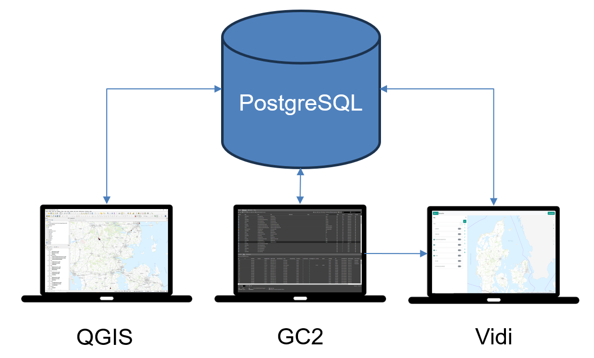
*GC2 / Vidi illustration*

---

## Login til GC2 Dashboard

For at få adgang til GC2 administrationsmodulet, anvendes følgende link:

<a
  href="https://mapgogc2.geopartner.dk/dashboard/sign-in"
  onClick={(e) => {
    e.preventDefault();
    window.open("https://mapgogc2.geopartner.dk/dashboard/sign-in", "_blank", "noopener,noreferrer");
  }}
>
  https://mapgogc2.geopartner.dk/dashboard/sign-in
</a>
  

<figure class="centered-figure">
  
  <figcaption>GC2 dashboard login</figcaption>
</figure>

Her logger du ind som "super-bruger" med det udleverede brugernavn eller e-mail samt adgangskode.

Når du er logget ind, vises en oversigt over de skemaer, der er tilgængelige i PostgreSQL-databasen.
Fra dette dashboard har du mulighed for at tilgå, konfigurere og administrere data i de enkelte skemaer.

Som standard vil en PostgreSQL-database altid have et "public" skema. I nedenstående figur ses, at der ligeledes er oprettet skemaerne **dandas**, **danvand** mv. Når der tilføjes nye skemaer i databasen, vil de fremgå af skemalisten i dashboardet.

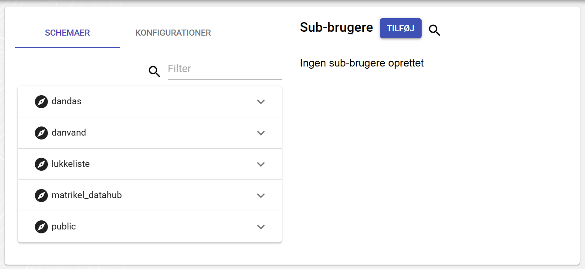
*GC2 dashboard*

## Oprettelse af sub-bruger i GC2

Som super-bruger kan du oprette "sub-brugere". Det er brugere med begrænsede rettigheder, som kun kan se og redigere de lag, super-brugeren har givet adgang til. Sub-brugere kan også anvende Vidi via det login, som oprettes, men brugeren vil udelukkende kunne se og redigere de lag, der er konfigureret adgang til.

Denne funktion gør det muligt at styre, hvilke data og lag specifikke sub-brugere har adgang til – både i GC2 og i Vidi.

For at oprette en sub-bruger, klik på knappen **"Tilføj"**.

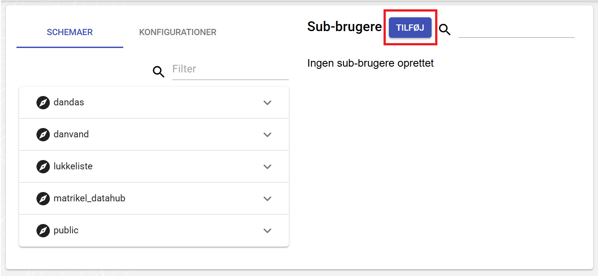
*Klik på "Tilføj" (rød boks) for at oprette en ny sub-bruger*

Når du klikker på **"Tilføj"**, åbnes et nyt vindue, hvor brugeroplysningerne for sub-brugeren kan indtastes.
Det vigtigste her er, at **Navn** og **Adgangskode** udfyldes korrekt.
Feltet **E-mail** anvendes ikke i øjeblikket og kan udfyldes med en vilkårlig adresse.

Det er muligt for en sub-bruger at **nedarve privilegier** fra en anden, allerede oprettet sub-bruger.
Det vil sige, at den nye bruger automatisk får de samme privilegier som den valgte sub-bruger. Dette kan f.eks. være en generel bruger, som du har givet adgang til at se og redigere bestemte lag – fx en bruger kaldet "edit_bruger".

Når du nedarver privilegier på denne måde, fungerer den valgte sub-bruger som en slags **brugergruppe**, hvor rettighederne styres centralt.
Det betyder, at du **ikke** kan give ekstra privilegier direkte til den nye bruger – al adgang styres gennem den bruger, der nedarves fra.

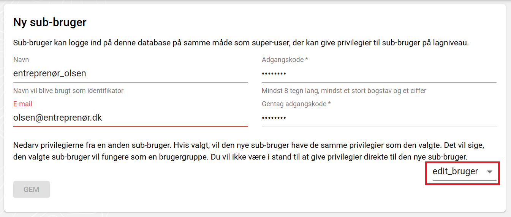
*Brugeroplysninger for ny sub-bruger. Vælg sub-bruger til nedarvning via dropdown (rød boks).*

Ved oprettelse af en sub-bruger i GC2 oprettes der automatisk et tilsvarende skema i PostgreSQL-databasen med samme navn som sub-brugeren.
Sub-brugeren får fulde rettigheder til dette skema og fungerer som ejer af data heri – med samme privilegier som en super-bruger.

### Tildeling af privilegier til sub-bruger i GC2

For at tildele privilegier til et lag, skal du åbne indstillingerne for det skema, laget er placeret i.
Dette gøres ved at klikke på pilen ud for skemanavnet og derefter vælge tandhjulsikonet:

<figure class="centered-figure">
  
  <figcaption>Åbn skemaindstillinger via pil og tandhjul</figcaption>
</figure>

Når du klikker på tandhjulet, åbnes et nyt faneblad i browseren.
Herfra kan du konfigurere, hvordan både Vidi og de enkelte lag opfører sig. I første omgang fokuserer vi på at sikre, at lagene har de rette **privilegier**.

Indstillingsvinduet er opdelt i flere faner:

<dl>
  <dt><strong>Kort</strong></dt>
  <dd>
    Her kan du styre symbolvisningen for lagene og se en forhåndsvisning af, hvordan laget vil fremstå i Vidi. (Dette gennemgås senere i kurset.)
    For mere information se <a href="https://geocloud2.readthedocs.io/da/latest/pages/standard/005_administrationsmodul.html#kort" target="_blank" rel="noopener noreferrer">brugedokumentation kort</a>.
  </dd>

  <dt><strong>Database</strong></dt>
  <dd>
    Her har du adgang til en række funktioner som tildeling af privilegier, opsætning af alias til kolonnenavne, valg af synlige kolonner i pop-up bokse m.m.
    For mere information se <a href="https://geocloud2.readthedocs.io/da/latest/pages/standard/005_administrationsmodul.html#database" target="_blank" rel="noopener noreferrer">brugedokumentation database</a>.
    I dette kursus fokuserer vi udelukkende på de vigtigste funktioner i denne fane.
  </dd>

  <dt><strong>Workflow</strong></dt>
  <dd>
    Ligger uden for dette kursus omfang og bliver ikke gennemgået.
    For mere information se <a href="https://geocloud2.readthedocs.io/da/latest/pages/standard/005_administrationsmodul.html#workflow-management" target="_blank" rel="noopener noreferrer">brugedokumentation workflow</a>.
  </dd>

  <dt><strong>Log</strong></dt>
  <dd>
    Ligger uden for dette kursus omfang og bliver ikke gennemgået.
    For mere information se <a href="https://geocloud2.readthedocs.io/da/latest/pages/standard/005_administrationsmodul.html#log" target="_blank" rel="noopener noreferrer">brugedokumentation log</a>.
  </dd>
</dl>

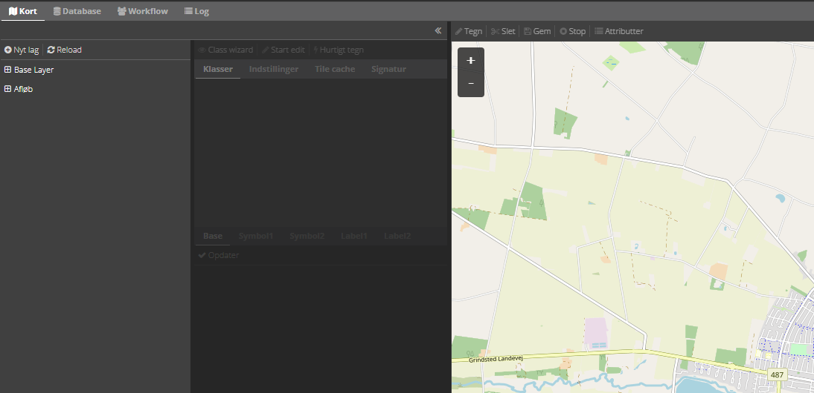
*Første vindue der ses i GC2 er kort-vinduet*

For at tildele privilegier trykkes der på fanen **"Database"**. På denne side vil der være menuer med mulige indstillingsmuligheder:

<dl>
  <dt><strong>Privilegier</strong></dt>
  <dd>
    I denne menu kan der tildeles privilegier til det valgte lag. For mere information se <a href="https://geocloud2.readthedocs.io/da/latest/pages/standard/005_administrationsmodul.html#privilegier" target="_blank" rel="noopener noreferrer">brugedokumentation privilegier</a>.
  </dd>

  <dt><strong>Workflow</strong></dt>
  <dd>
    Ligger uden for dette kursus omfang og bliver ikke gennemgået.
  </dd>

  <dt><strong>Avanceret</strong></dt>
  <dd>
    Ligger uden for dette kursus omfang og bliver ikke gennemgået.
  </dd>

  <dt><strong>Tjenester</strong></dt>
  <dd>
    I denne menu kan der opsættes diverse webservice-tjenester, hvis laget skal tilgås f.eks. via WMS/WFS. (Dette gennemgås senere i kurset.)
  </dd>

  <dt><strong>Tags</strong></dt>
  <dd>
    I denne menu kan et lag tildeles et "tag", som kan bruges til at tilføje lag til en specifik konfiguration. (Dette gennemgås senere i kurset.)
  </dd>

  <dt><strong>Meta</strong></dt>
  <dd>
    Ligger uden for dette kursus omfang og bliver ikke gennemgået.
  </dd>
</dl>

For at tildele privilegier til et lag vælges laget i laglisten, og der klikkes på **"Privilegier"**.
Herefter åbnes en menu, hvor du kan tildele forskellige privilegier til sub-brugere.

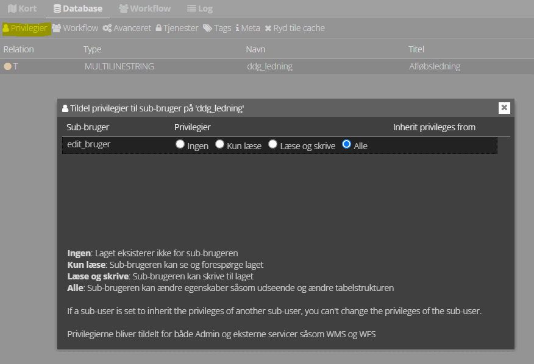
*Tildeling af sub-bruger privilegier*

Hvis du har mange sub-brugere, kan du tildele privilegier individuelt til hver enkelt.
Sub-brugere, der nedarver rettigheder fra en anden bruger, vil også fremgå af listen – men deres privilegier kan **ikke** redigeres direkte, da disse styres af den sub-bruger, de nedarver fra.

---

## Tjenester

GC2 gør det muligt at eksponere data fra et skema som webtjenester, der kan tilgås fra f.eks. GIS-klienter som QGIS eller via direkte API-kald.
Dette sker gennem standardiserede OWS-tjenester som **WMS** og **WFS**, hvor du både kan visualisere og hente geodata.
I dette afsnit gennemgår vi, hvordan du konfigurerer disse tjenester, opsætter adgang og anvender SQL direkte via API.

### Konfiguration af tjenester

For at konfigurere tjenester trykkes der på menuen **"Tjenester"**. Når du klikker her, åbnes en indstillingsmenu, hvor det vigtigste er at opsætte et **HTTP Basic Password**.
Dette password bruges til at beskytte adgangen til webtjenesten og er **uafhængigt** af login-oplysninger for både super-brugere og sub-brugere.

:::caution[Vigtigt]
Når adgangskoden først er oprettet og delt, bør den **ikke ændres**. Hvis den ændres, vil eksisterende forbindelser stoppe med at virke, og brugere, der tidligere har fået link og loginoplysninger, skal informeres om ændringen.
:::

Når adgangskoden er sat, vises et link under teksten:

*The OWS services includes WMS (up to 1.3) and WFS (up to 2.0).*

Dette link kan bruges til at oprette forbindelse til lagene i skemaet fra GIS-software – f.eks. QGIS.

**Eksempler på URL og login**

Hvis du er logget ind som super-bruger: 
**URL:** `https://mapgogc2.geopartner.dk/ows/<database>/<skema-navn>/` 
**Brugernavn:** `<super-bruger>` 
**Adgangskode:** •••••••••• 

:::note[Bemærk]
Database-navn og super-bruger-navn er altid identiske, når man er logget ind som super-bruger
:::

Hvis du er logget ind som sub-bruger: 
**URL:** `https://mapgogc2.geopartner.dk/ows/<sub-bruger@database>/<skema-navn>/` 
**Brugernavn:** `<sub-bruger@database>` 
**Adgangskode:** ••••••••••

### Eksempel på oprettelse af webtjeneste for sub-bruger

Herunder ses et eksempel, hvor sub-brugeren **edit_bruger** er logget ind og opretter en webtjeneste for skemaet **forsyningsdata**:

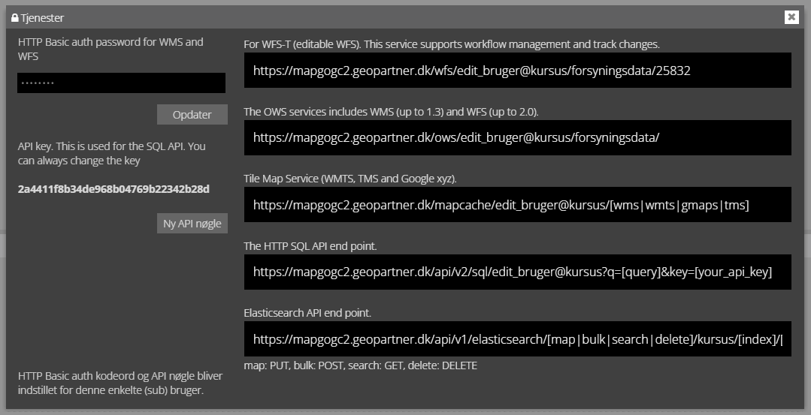
*Oprettelse af webtjeneste for sub-bruger*

I dette tilfælde vil brugeroplysningerne være:

**URL:** `https://mapgogc2.geopartner.dk/ows/edit_bruger@kursus/forsyningsdata/` 
**Brugernavn:** `edit_bruger@kursus` 
**Adgangskode:** ••••••••••

### Tilføjelse af login direkte i URL (HTTP Basic Authentication)

Hvis du ønsker at tilgå tjenesten direkte via en URL – f.eks. i en browser eller ved test af en `GetCapabilities`-forespørgsel – kan du tilføje brugernavn og adgangskode direkte i URL'en ved hjælp af HTTP Basic Authentication.

<strong>URL'en kan formateres på følgende måde:</strong>

<code>`https://<brugernavn>:<password>@mapgogc2.geopartner.dk/ows/<database>/<skema>/?service=WMS&request=GetCapabilities`</code>

<strong>Eksempel med super-bruger:</strong>

<code>`https://kursus:<password>@mapgogc2.geopartner.dk/ows/kursus/forsyningsdata/?service=WMS&request=GetCapabilities`</code>

<strong>Eksempel med sub-bruger:</strong>

<code>`https://edit_bruger@kursus:<password>@mapgogc2.geopartner.dk/ows/edit_bruger@kursus/forsyningsdata/?service=WFS&request=GetCapabilities`</code>

 
 
:::note[Bemærk]
Denne metode bør kun bruges til test eller midlertidig adgang, da adgangskoden vises i klartekst i URL'en.*
:::

### Adgang via SQL-API

Det er muligt at foretage direkte SQL-forespørgsler mod lag via GC2's API ved hjælp af en API-nøgle. API-nøglen står under det sted hvor der oprettes et HTTP basic password.
Dette kan bruges til at hente eller filtrere data fra et specifikt lag uden at bruge GIS-klienter som QGIS eller Vidi.

Forespørgslen sendes via følgende URL-format:

`https://mapgogc2.geopartner.dk/api/v2/sql/<bruger@database&>?q=[SQL-forespørgsel]&key=[din_api_nøgle]`

**Herunder ses eksempel med "edit_bruger"**

Forespørgslen returnerer alle rækker fra laget <strong>forsyningsdata.ddg_ledning</strong>:

<code>https://mapgogc2.geopartner.dk/api/v2/sql/edit_bruger@kursus?q=SELECT * FROM forsyningsdata.ddg_ledning&key=din_api_noegle</code>

 
 
:::note[Bemærk]
* Din API-nøgle fungerer som adgangskontrol og skal behandles fortroligt.
* Brugernavnet (`edit_bruger@kursus`) og databasen skal stemme overens med den bruger og det skema, du ønsker adgang til.
* SQL-syntaksen skal være korrekt – og det anbefales kun at anvende **SELECT**-forespørgsler, medmindre du ved, hvad du laver.
:::

## Import af lag via GC2

Hvis man er logget ind som sub-bruger, er det kun muligt at importere nye lag i sub-brugerens eget skema.
Super-brugeren har derimod mulighed for at tilføje nye lag til alle skemaer.

I fanen **"Database"** er det muligt at importere nye lag til det valgte skema. Dette gøres ved at trykke på menuen **"Nyt lag"**.

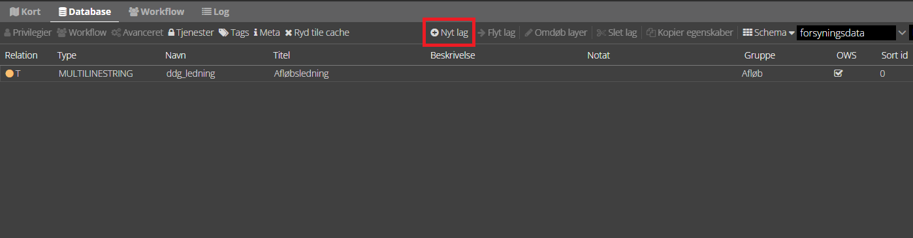
*Tryk på menu-knappen "**Nyt lag**" for at åbne menu til indlæsning af nye lag*

Herefter åbnes en ny menu, hvor det er muligt at indlæse forskellige GIS-filtyper:

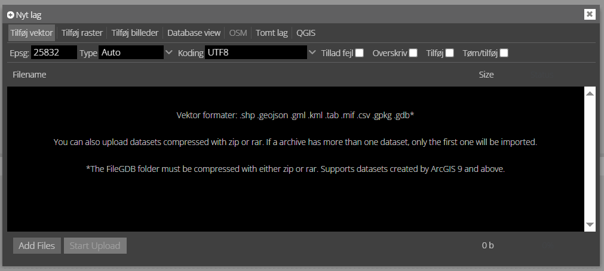
*Menu til indlæsning af nye lag*

I dette kursus fokuserer vi kun på indlæsning af vektordata.
Det er dog også muligt at importere andre typer lag, herunder fra QGIS-projekter.
Disse muligheder gennemgås ikke her – se i stedet den officielle dokumentation:
[brugerdokumentation nyt lag](https://geocloud2.readthedocs.io/da/latest/pages/standard/005_administrationsmodul.html#nyt-lag)

GIS-filen kan trækkes direkte ind i upload-vinduet.
Når filen er valgt, trykkes på knappen **"Start Upload"**, hvorefter filen importeres i det valgte skema.
Derefter kan laget videre konfigureres via GC2.

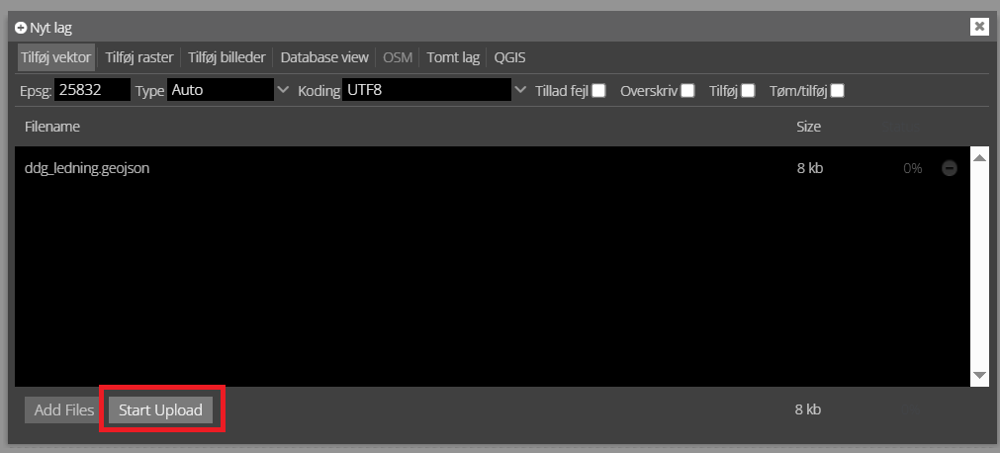
*Tryk på **"Start Upload"** for at starte upload af nyt lag*

## Lagopsætning i GC2

Dette afsnit gennemgår, hvordan man konfigurerer lag i GC2 – herunder hvilke egenskaber man kan sætte på lag og deres kolonner. Du får et overblik over laglisten, hvordan man arbejder med grupper og undergrupper, samt hvordan man opsætter tabelstruktur, aliaser, filtre og andre relevante metadata.

#### Lagliste

Øverste del af fanen rummer en linje med forskellige funktioner. Under linjen findes laglisten. Laglisten har følgende egenskaber.

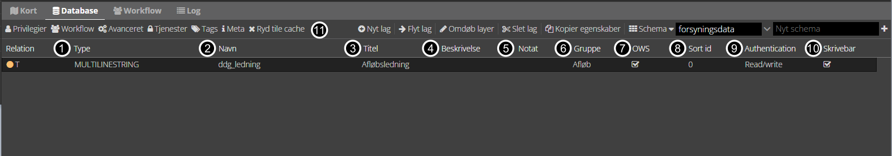
*Lagliste egenskaber*

<ol>
  <li style="margin-bottom: 0.5em;"><strong>Type:</strong> Lagets geometritype, som kan være (MULTI)POINT, (MULTI)LINESTRING, (MULTI)POLYGON eller GEOMETRY. 
  GEOMETRY betyder, at laget kan indeholde en blanding af flere forskellige geometrityper. Lagets type kan ikke ændres.</li>
  <li style="margin-bottom: 0.5em;"><strong>Navn:</strong> Det tekniske navn på laget. Hvis laget er importeret fra en fil, svarer navnet typisk til filnavnet eller tabelnavnet i databasen. Lagets tekniske navn kan ikke ændres.</li>
  <li style="margin-bottom: 0.5em;"><strong>Titel:</strong> Lagets titel, som vises i lagtræet, i signaturforklaringer og som titel i WMS/WFS-tjenester.</li>
  <li style="margin-bottom: 0.5em;"><strong>Beskrivelse:</strong> En beskrivende tekst til laget. Bruges som <em>abstract</em> i WMS/WFS-tjenester.</li>
  <li style="margin-bottom: 0.5em;"><strong>Notat:</strong> En beskrivende intern tekst til laget.</li>
  <li style="margin-bottom: 0.5em;"><strong>Gruppe:</strong> Bruges til at inddele lag i grupper i <strong>Kort</strong>-fanen og i Vidi. 
  Dette er et kombinationsfelt: Du kan enten skrive en ny gruppetitel eller vælge en eksisterende. For at lave en subgruppe anvendes menuen <strong>»Meta«</strong>, se figur herunder.</li>
  <li style="margin-bottom: 0.5em;"><strong>OWS:</strong> Bruges til at definere om laget skal være tilgængeligt via webtjenester.</li>
  <li style="margin-bottom: 0.5em;"><strong>Sort id:</strong> Angiver lagets placering i laghierarkiet. Et højere tal placerer laget øverst i visningen i <strong>Kort</strong>-fanen og i Vidi.</li>
  <li style="margin-bottom: 0.5em;">
    
<strong>Authentication:</strong> Adgangsniveau for WMS/WFS-tjenester samt Vidi:

    <ul>
      <li>
<strong>None:</strong> Ingen login kræves – hverken for at se eller redigere data.

Alle har adgang til både visning og redigering, også uden login. Bør kun anvendes til åbne eller interne testmiljøer.
</li>
      <li>
<strong>Write:</strong> Login kræves kun ved redigering.

Alle kan se data uden login, men der kræves login for at ændre indhold.
</li>
      <li>
<strong>Read/Write:</strong> Login kræves ved både visning og redigering.

Data er kun tilgængelige for brugere med login. Anvendes typisk til følsomme eller interne datasæt.
</li>
    </ul>
  </li>
  <li style="margin-bottom: 0.5em;"><strong>Skrivebar:</strong> Hvis slået fra, kan laget ikke redigeres i <strong>Kort</strong>-fanen eller via WFS-T (Web Feature Service – Transactional).</li>
  <li style="margin-bottom: 0.5em;"><strong>Tile cache:</strong> Bruges til manuelt at rydde lagets tile cache. Normalt ikke nødvendigt, da GC2 håndterer dette automatisk ved ændringer.</li>
</ol>

Det er muligt at tilføje et lag til en undergruppe ved at tilgå "**Meta**" menuen, hvis man scroller ned til bunden så vil der være en mulighed for at tilføje hvilken undergruppe laget skal tilhøre.

<figure class="centered-figure">
  
  <figcaption>Meta egenskaber for lag, tilføjelse af undergruppe</figcaption>
</figure>

Laget vil derefter i Vidi ligge i en undergruppe

<figure class="centered-figure">
  
  <figcaption>Lag tilføjet til undergruppe "Knudetekst"</figcaption>
</figure>

#### Tabelstruktur i GC2

Når et lag vælges i laglisten, vises lagets tabelstruktur i sektionen nedenunder.
Her kan du konfigurere egenskaber for de enkelte kolonner i laget. Det er bl.a. muligt at:

- Tilføje eller slette kolonner
- Give kolonner et alias (et mere brugervenligt visningsnavn i Vidi)
- Vælge hvilke kolonner der skal vises i info-værktøjet
- Gøre indholdet i kolonner til klikbare links
- Aktivere søgning eller filtrering på specifikke kolonner

Herunder gennemgås de forskellige egenskaber, der kan sættes pr. kolonne:

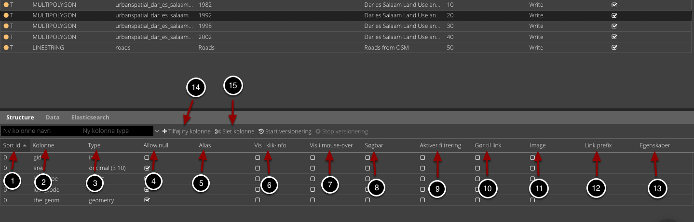
*Muligheder for tabelstrukturen*

<ol>
  <li style="margin-bottom: 0.5em;"><strong>Sort id:</strong> Angiver rækkefølgen kolonner vises i ved anvendelse af info-værktøjet i Vidi. Kolonner med lavere værdi vises øverst.</li>
  <li style="margin-bottom: 0.5em;"><strong>Kolonne:</strong> Navnet på kolonnen. Kan ændres, men det anbefales at bruge et alias (punkt 5) i stedet.</li>
  <li style="margin-bottom: 0.5em;"><strong>Type:</strong> Kolonnens datatype. Kan ikke ændres.</li>
  <li style="margin-bottom: 0.5em;"><strong>Allow null:</strong> Angiver om kolonnen må indeholde tomme værdier.</li>
  <li style="margin-bottom: 0.5em;"><strong>Alias:</strong> Vist navn i Vidi ved brug af info-værktøj. Gør kolonnen lettere at forstå for brugeren.</li>
  <li style="margin-bottom: 0.5em;"><strong>Vis i klik-info:</strong> Bestemmer om kolonnen vises ved anvendelse af info-værktøjet samt tableoversigt i Vidi. 
  Som udgangspunkt vises alle kolonner, men fravalgte felter skjules.</li>
  <li style="margin-bottom: 0.5em;"><strong>Vis i mouse-over:</strong> Viser kolonnen, når musen holdes over et objekt i Vidi.</li>
  <li style="margin-bottom: 0.5em;"><strong>Søgebar:</strong> Gør kolonnen søgbar i Vidi.</li>
  <li style="margin-bottom: 0.5em;"><strong>Aktiver filtrering:</strong> Tillader brugeren at filtrere på værdier i denne kolonne.</li>
  <li style="margin-bottom: 0.5em;"><strong>Gør til link:</strong> Hvis kolonnen indeholder et link, kan det aktiveres, så det kan åbnes direkte fra Vidi.</li>
  <li style="margin-bottom: 0.5em;"><strong>Image:</strong> Bruges hvis kolonnen indeholder billed-URL'er. Viser billeder i Vidi.</li>
  <li style="margin-bottom: 0.5em;"><strong>Link prefix:</strong> Tilføjer f.eks. <code>http://</code> hvis det mangler i link-kolonner.</li>
  <li style="margin-bottom: 0.5em;"><strong>Egenskaber:</strong> Kan indeholde ekstra information til brug i brugerdefinerede applikationer. 
  Se mere her: <a href="https://vidi-wiki.geopartner.dk/pages/standard/92_gc2_meta_information.html#egenskaber" target="_blank">brugerdokumentation egenskaber</a></li>
  <li style="margin-bottom: 0.5em;"><strong>Tilføj ny kolonne:</strong> Opretter en ny kolonne i lagets tabel.</li>
  <li style="margin-bottom: 0.5em;"><strong>Slet kolonne:</strong> Sletter den valgte kolonne fra tabellen.</li>
</ol>

I det følgende vises et simpelt eksempel på konfiguration af tabelstruktur:

<figure class="centered-figure">
  
  <figcaption>Eksempel på konfiguration af tabelstruktur</figcaption>
</figure>

#### Filtrering

I tabelstrukturen er det muligt at definere hvilke kolonner der kan filtrers på. Dette gør det muligt at foretage både simple og avancerede filtrering af objekter i selve laget.

Dette kan f.eks. opsættes ved at lave en liste af objekter under "Egenskaber" i tabelstrukturen:

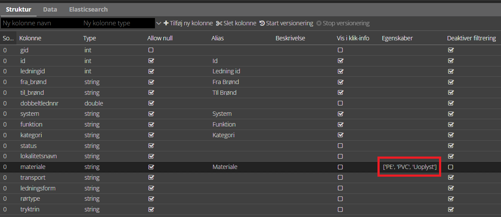
*Eksempel på konfiguration af filtrering via listevalg i tabelstrukturen*

Når der opsættes et filter i Vidi på det dette lag, så vil listeværdierne kunne vælges i filtreringslisten.

<figure class="centered-figure">
  
  <figcaption>Eksempel på filtrering via listevalg</figcaption>
</figure>

Det er muligt at opsætte mere avancerede listevalg f.eks. ved at referere til en tabel i en database, men dette ligger uden for omfanget af dette kursus.

Det er ligeledes muligt at opsætte foruddefinerede filtrering, dette gøres via "Meta" menuen, men ligger ligeledes uden for omfanget af dette kursus.

<figure class="centered-figure">
  
  <figcaption>Eksempel på foruddefineret filter</figcaption>
</figure>

#### Layouts til MapConnect

Eksempel på indlejret kort på hjemmeside: [Nyborg kommune grundsalg](https://www.nyborg.dk/da/borger-og-selvbetjening/bolig-og-byggeri/vil-du-bygge/villagrunde-bolig-og-byggeri/hoejvaenget-svindinge-5853-oerbaek/)

## Tematisering af lag i "Kort" fanen

Se [brugerdokumentation tematisering](https://geocloud2.readthedocs.io/da/latest/pages/standard/005_administrationsmodul.html#tematisering)

## Konfigurationer

Se [brugerdokumentation kørselskonfiguration](https://vidi-wiki.geopartner.dk/pages/standard/91_run_configuration.html)