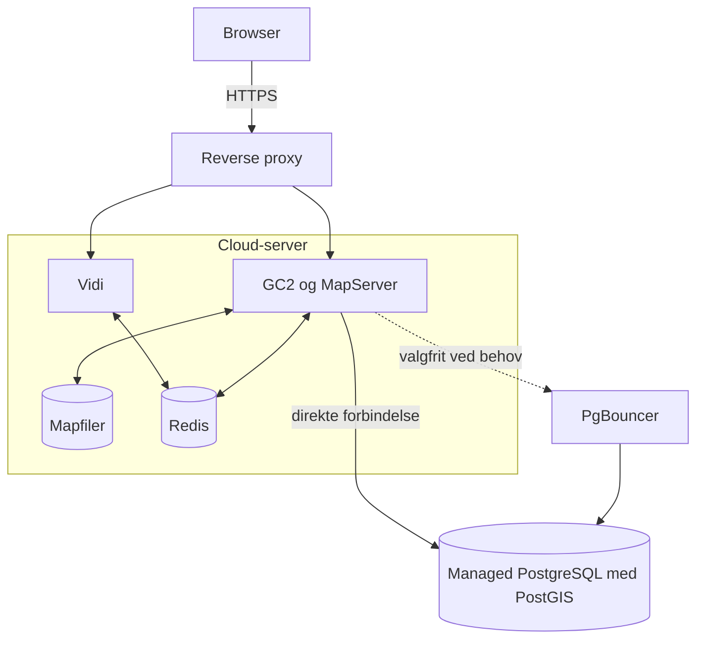

## Få overblik

GC2 og Vidi kan startes lokalt på én computer eller installeres som en løsning, der er tilgængelig for andre. De to situationer har forskellige formål:

| Spor | Vælg dette når | Resultat |
|---|---|---|
| **Lokal udvikling og afprøvning** | Du vil afprøve GC2/Vidi, følge vejledningerne eller ændre kildekoden | Tjenesterne kører lokalt med Docker; ved kodeændringer arbejder du desuden i GC2- eller Vidi-repositoryet |
| **Produktion** | Andre skal bruge løsningen stabilt og sikkert | GC2/Vidi kører på servere med domæner, HTTPS, database, backup og overvågning |

:::tip[Hvis du er i tvivl]
Begynd med **Lokal udvikling og afprøvning** og start det samlede testmiljø. Det giver et konkret billede af systemerne. Du behøver kun hente GC2- eller Vidi-kildekoden særskilt, hvis du vil ændre selve programmerne.
:::

De vigtigste dele er PostgreSQL/PostGIS, GC2, MapServer og Vidi. En produktionsløsning kan desuden bruge Redis til sessioner og cache samt PgBouncer til at genbruge databaseforbindelser. Den præcise dataflytning og forskellen mellem Tile, Vector, MVT, WebGL, WMS og WFS forklares under [Teknisk arkitektur og lagvisning](/gc2/teknisk-arkitektur-og-lagvisning).

## Lokal udvikling og afprøvning

### Det skal du installere

| Krav | Hvad bruges det til? | Hent eller installér |
|---|---|---|
| Git | Henter repositoryet og senere opdateringer | <a href="https://git-scm.com/downloads/" target="_blank" rel="noopener noreferrer">Download Git</a> |
| Docker Desktop | Starter det samlede lokale miljø. Docker Compose følger med | <a href="https://docs.docker.com/desktop/" target="_blank" rel="noopener noreferrer">Installér Docker Desktop</a> |
| Port `8080` og `3000` | Bruges lokalt til henholdsvis GC2 og Vidi | Kontrollér at andre programmer ikke bruger portene |

:::note[Bruger du Linux lokalt?]
På Windows og macOS er Docker Desktop den enkleste løsning. Hvis din lokale computer kører Linux, skal du i stedet installere <a href="https://docs.docker.com/engine/install/" target="_blank" rel="noopener noreferrer">Docker Engine</a> og <a href="https://docs.docker.com/compose/install/linux/" target="_blank" rel="noopener noreferrer">Compose-pluginet</a>. Docker Engine behandles særskilt i produktionsafsnittet, hvor løsningen installeres på en Linux-server.
:::

Kontrollér installationen i en terminal:

```bash
git --version
docker --version
docker compose version
```

### Start et samlet lokalt testmiljø

Den nemmeste start er det samlede <a href="https://github.com/mapcentia/gc2-vidi-docker-compose" target="_blank" rel="noopener noreferrer">gc2-vidi-docker-compose-repository</a>:

```bash
git clone https://github.com/mapcentia/gc2-vidi-docker-compose.git
cd gc2-vidi-docker-compose
docker compose up -d
```

Se om tjenesterne er startet:

```bash
docker compose ps
```

Listen vil normalt vise GC2, Vidi, PostgreSQL og hjælpetjenester som Redis. MapServer kan være installeret i GC2-miljøet uden at optræde som en særskilt container. PgBouncer er ikke en selvstændig tjeneste i GC2-repositoryets nuværende udviklings-Compose og vises derfor ikke nødvendigvis. Kontrollér altid Compose-filen for den version, du bruger.

Første opstart kan tage flere minutter, fordi Docker først skal hente de nødvendige images. Når miljøet er klar:

1. Åbn GC2 på [http://localhost:8080](http://localhost:8080).
2. Vælg **Create New Account**, og opret den første databaseejer og database.
3. Importér eller opret et lag i skemaet `public`.
4. Giv laget en **Group**, så det kan vises i Vidis lagtræ.
5. Åbn Vidi på adressen nedenfor, og erstat `<database>` med databasenavnet.

```
http://localhost:3000/app/<database>/public
```

**Eksempel:** Hvis databasen hedder `demo`, åbnes Vidi på:

```text
http://localhost:3000/app/demo/public
```

Fortsæt med [Log ind og kontrolcenter](/gc2/log-ind-og-dashboard) og [Opret, importer og organiser lag](/gc2/skemaindstillinger/database/opret-importer-og-organiser-lag).

:::caution[Miljøet er kun til test]
Compose-repositoryet er dokumenteret som et testmiljø og har blandt andet brugt databaseadgangskoden `1234`. Eksponér det ikke på internettet, og brug ikke produktionsdata i det.
:::

### Udvikl i GC2- eller Vidi-koden

Quickstarten er velegnet til at afprøve systemet, men ikke nødvendigvis til at ændre kildekoden. Til kildekodeudvikling bruges de to repositories hver for sig:

- <a href="https://github.com/mapcentia/geocloud2" target="_blank" rel="noopener noreferrer">GeoCloud2-kildekode</a>
- <a href="https://github.com/mapcentia/vidi" target="_blank" rel="noopener noreferrer">Vidi-kildekode</a>

Et typisk udviklingsforløb er:

1. Klon det repository, du vil ændre.
2. Følg repositoryets aktuelle `README.md` og eventuelle `AGENTS.md`.
3. Start de nødvendige database- og cachetjenester.
4. Konfigurér Vidi til at pege på den GC2-instans, du udvikler imod.
5. Byg og start den ændrede applikation.
6. Kør repositoryets relevante tests, før ændringen flyttes videre.

GC2-repositoryet indeholder et Dev Container-miljø til blandt andet VS Code og PhpStorm. Vidi har sit eget Node.js-build og sin egen `config.js`. De ældre trin i dokumentationens `_bak`-mappe er kun historisk reference og skal ikke bruges uden kontrol mod de aktuelle repositories.

### Stop eller fejlfind det lokale miljø

Stop containerne uden at bede Docker om at slette volumes:

```bash
docker compose down
```

Se status og de seneste logs:

```bash
docker compose ps
docker compose logs --tail=100
```

Kontrollér derefter:

1. om port `8080` eller `3000` allerede bruges af et andet program
2. om GC2 svarer på `http://localhost:8080`
3. om Vidi svarer på `http://localhost:3000`
4. om Vidi kan finde GC2-tjenesten `gc2core` på Docker-netværket
5. om databasenavnet i Vidi-adressen er stavet korrekt

## Produktion

En produktionsinstallation er mere end en Compose-fil, der kan starte. Den skal også kunne opdateres, overvåges og gendannes, og uvedkommende må ikke få adgang til databasen eller administrative funktioner.

Følg trinene i rækkefølge første gang. De går fra beslutninger om ansvar og placering over database og server til test og løbende drift. Den konkrete cloududbyder kan have andre produktnavne, men opdelingen og ansvaret er det samme.

### En anbefalet startarkitektur

For en mindre eller mellemstor løsning er et forståeligt udgangspunkt:



Her kører GC2, MapServer og Vidi som tæt forbundne tjenester på en virtuel Linux-server. Den konkrete containeropdeling afhænger af deploymentet. Redis kan køre som en intern container eller som en managed tjeneste. PostgreSQL kører ikke i den lokale Compose-stak, men som en separat managed databaseservice. Databasen kan derfor sikkerhedskopieres og vedligeholdes uafhængigt af applikationsserveren. PgBouncer er valgfri og placeres mellem GC2 og PostgreSQL, hvis belastningen eller databaseudbyderens forbindelsesgrænse gør den nødvendig.

:::note[De vigtigste begreber]
- **Cloud-server eller compute** er den virtuelle server, hvor GC2- og Vidi-containerne bruger CPU og hukommelse.
- **Managed database** betyder, at udbyderen driver PostgreSQL-tjenesten. I har stadig ansvar for data, brugere, PostGIS, rettigheder og test af restore.
- **Privat netværk** gør databasen tilgængelig for GC2 uden at åbne den for hele internettet.
- **Reverse proxy** modtager HTTPS på jeres domæner og sender trafikken videre til GC2 eller Vidi.
- **Secret store** opbevarer passwords og andre hemmeligheder uden for kildekoden.
- **Redis** er et hurtigt, midlertidigt datalager til blandt andet sessioner og cache. Det erstatter ikke PostgreSQL eller databasebackup.
- **PgBouncer** er en forbindelsespulje foran PostgreSQL. Den genbruger databaseforbindelser, så mange korte forespørgsler ikke åbner lige så mange nye forbindelser.
:::

### Trin 1: Beslut adresser, ansvar og krav

Beslut først:

- hvilke domæner brugerne skal anvende, eksempelvis `admin.kort.example.dk` til GC2 og `kort.example.dk` til Vidi
- hvilken region data skal ligge i
- hvem der har ansvar for server, database, GC2-administration og sikkerhed
- hvor længe løsningen må være utilgængelig
- hvor meget data I kan acceptere at miste ved et nedbrud
- hvilke krav der gælder for databehandleraftale, persondata og logning

**Eksempel:** En mindre organisation vælger én cloud-server til GC2/Vidi, en managed PostgreSQL-instans i samme region og daglige backups. Organisationen udpeger én serveroperatør og én GC2-administrator og aftaler, hvem der udfører en restore-test hvert kvartal.

### Trin 2: Vælg cloududbyder og driftsmodel

Udbyderen skal kunne levere en Linux-server med Docker og enten en managed PostgreSQL-tjeneste med de nødvendige PostGIS-udvidelser eller et miljø, hvor I selv driver databasen.

| Udbyder | Eksempel på opdeling | Vigtigt at kontrollere |
|---|---|---|
| <a href="https://www.ovhcloud.com/en/public-cloud/" target="_blank" rel="noopener noreferrer">OVHcloud</a> | Public Cloud compute og Managed PostgreSQL | Den officielle liste omfatter `postgis`, `postgis_raster` og `pgrouting`; kontrollér version og plan |
| <a href="https://www.scaleway.com/en/" target="_blank" rel="noopener noreferrer">Scaleway</a> | Instance og Managed Database for PostgreSQL | Den officielle liste omfatter `postgis`, `postgis_raster`, `pgcrypto` og `pgrouting` |
| <a href="https://www.hetzner.com/cloud/" target="_blank" rel="noopener noreferrer">Hetzner Cloud</a> | Cloud-server med Docker og en selvdriftet eller ekstern database | I har selv ansvar for operativsystem og de tjenester, som ikke er managed |
| <a href="https://aws.amazon.com/" target="_blank" rel="noopener noreferrer">Amazon Web Services</a> | EC2 eller containerplatform sammen med RDS for PostgreSQL | RDS understøtter PostGIS; kontrollér øvrige udvidelser, rettigheder og juridiske krav |

Se udbydernes aktuelle dokumentation: <a href="https://help.ovhcloud.com/csm/en-ie-public-cloud-databases-postgresql-extensions?id=kb_article_view&sysparm_article=KB0049335" target="_blank" rel="noopener noreferrer">OVHclouds PostgreSQL-udvidelser</a>, <a href="https://www.scaleway.com/en/docs/managed-databases-for-postgresql-and-mysql/reference-content/postgresql-extensions/" target="_blank" rel="noopener noreferrer">Scaleways PostgreSQL-udvidelser</a>, <a href="https://docs.hetzner.com/cloud/apps/list/docker-ce/" target="_blank" rel="noopener noreferrer">Hetzners Docker-image</a> og <a href="https://docs.aws.amazon.com/AmazonRDS/latest/UserGuide/Appendix.PostgreSQL.CommonDBATasks.Extensions.html" target="_blank" rel="noopener noreferrer">AWS' PostgreSQL-udvidelser</a>.

### Trin 3: Opret PostgreSQL/PostGIS

1. Opret den managed PostgreSQL-instans i samme region som cloud-serveren.
2. Forbind databasen og cloud-serveren gennem et privat netværk, eller begræns databaseadgangen til cloud-serverens faste adresser.
3. Kontrollér at `postgis`, `postgis_raster`, `pgcrypto` og eventuelt `pgrouting` er tilgængelige i den valgte PostgreSQL-version.
4. Opret en administrativ databasekonto til installationen.
5. Planlæg en separat konto med de rettigheder, GC2 behøver i normal drift.
6. Aktivér udbyderens backup, og beslut hvor længe backups skal gemmes.
7. Dokumentér, hvordan en backup gendannes til en ny database.

#### Beslut om PgBouncer er nødvendigt

Start gerne med en direkte forbindelse til PostgreSQL, hvis udbyderens forbindelsesgrænse og jeres belastning tillader det. Overvej PgBouncer, hvis løsningen laver mange korte databaseforbindelser, hvis flere applikationsservere deler databasen, eller hvis den managed database har en lav forbindelsesgrænse.

Et praktisk forløb er:

1. Test først GC2 direkte mod PostgreSQL.
2. Mål antallet af forbindelser under en realistisk belastning.
3. Aktivér udbyderens pooler, eller start PgBouncer som en separat intern tjeneste, hvis testen viser et behov.
4. Sæt `POSTGRES_HOST` og `POSTGRES_PORT` til PgBouncers adresse i stedet for PostgreSQLs direkte adresse.
5. Sæt `POSTGRES_PGBOUNCER=true`, og test import, korttjenester, transaktioner og baggrundsjob igen.

:::caution[Indstillingen installerer ikke PgBouncer]
`POSTGRES_PGBOUNCER=true` fortæller GC2, at databaseforbindelsen allerede går gennem PgBouncer. Indstillingen starter eller konfigurerer ikke selve PgBouncer-tjenesten.
:::

:::caution[Kontrollér rettigheder og TLS før valg af database]
Managed tjenester giver normalt ikke fuld PostgreSQL-superbrugeradgang. GC2 skal kunne oprette og klargøre databaser, skemaer og nødvendige udvidelser. GC2 har desuden flere databaseadgangsveje, og enkelte kildekodestier angiver fortsat `sslmode=disable`. Afprøv derfor installation, import, raster, OWS og QGIS mod udbyderens rettigheds- og TLS-krav, før tjenesten godkendes til produktion.
:::

### Trin 4: Opret serveren til GC2 og Vidi

1. Opret en Linux-server i samme region og private netværk som databasen.
2. Installér Docker Engine og Docker Compose.
3. Begræns SSH-adgang til kendte administratorer og brug SSH-nøgler.
4. Installér eller tilpas en Compose-fil, som starter GC2, Vidi og nødvendige hjælpetjenester – men ikke en lokal PostgreSQL-container.
5. Fastlås de anvendte GC2- og Vidi-images til konkrete versioner. Brug ikke automatisk en flydende `latest`-version i produktion.
6. Start først løsningen, når database- og secret-indstillingerne er på plads.

**Eksempel på serviceforbindelser:**

```text
GC2       → db.internal.example:5432
Vidi      → http://gc2core på det interne Docker-netværk
Browser   → https://kort.example.dk
GC2-admin → https://admin.kort.example.dk
```

#### Tilføj Redis til sessioner og cache

GC2-repositoryets aktuelle udviklings-Compose starter Redis sammen med GC2 og PostgreSQL. GC2s standardkonfiguration bruger Redis til applikationscache og sessioner. I en mindre produktion kan Redis køre som en intern container på applikationsserveren. Redis-porten skal ikke åbnes mod internettet.

Hvis I kører flere GC2- eller Vidi-servere, bør de bruge den samme Redis-tjeneste, så en bruger ikke mister sin session, når trafikken rammer en anden server. Her kan en managed Redis-tjeneste være lettere at overvåge, vedligeholde og skalere end en lokal container.

Vidi kan bruge Redis til sessioner, når `redis.host` er sat i installationens `config.js`. Uden denne indstilling bruger Vidi som udgangspunkt filbaserede sessioner i `/tmp/sessions`. Filbaserede sessioner er lokale for den enkelte server og er derfor ikke egnede som delt sessionslager mellem flere Vidi-servere.

:::tip[Redis indeholder midlertidige data]
Planlæg løsningen, så geodata og nødvendig konfiguration ligger i PostgreSQL eller i anden persistent lagring. En tom Redis efter genstart må højst betyde, at cache skal genopbygges, eller at brugerne skal logge ind igen.
:::

#### Håndtér mapfiler i produktion

GC2-processen skal have skriveadgang til `app/wms/mapfiles`, og MapServer skal kunne læse de samme filer. På én applikationsserver kan mappen ligge på et persistent volume, eller mapfilerne kan regenereres kontrolleret efter et deployment. Mappen `app/tmp` kan normalt være midlertidig.

Hvis flere GC2/MapServer-instanser kører samtidig, skal alle instanser have en opdateret version af mapfilerne. Det kan løses med et sikkert fælles volume eller ved at regenerere filerne på hver instans som del af deploymentet. Test dette, før trafikken fordeles mellem instanserne; ellers kan samme lag virke på én server og fejle på en anden.

### Trin 5: Tilføj forbindelsesindstillinger og secrets

GC2 læser de samme miljøvariabelnavne lokalt og i produktion. Forskellen er, hvordan værdierne leveres:

| Miljø | Typisk metode |
|---|---|
| Lokal test | `.env` eller Compose `env_file` |
| Produktion | Deploymentsystemet sætter miljøvariablerne; hemmeligheder hentes fra en secret store |

:::note[Miljøvariabel og `.env`-fil er ikke det samme]
En miljøvariabel er en værdi, som processen kan læse ved opstart. En `.env`-fil er blot én måde at indlæse værdien på. I produktion kan de samme variabelnavne sættes uden en `.env`-fil.
:::

GC2 forventer disse navne:

```dotenv
POSTGRES_HOST=db.internal.example
POSTGRES_PORT=5432
POSTGRES_DB=postgres
POSTGRES_USER=<gc2-servicebruger>
POSTGRES_PASSWORD=<hemmelig-værdi>
POSTGRES_PGBOUNCER=false
MODE_ENV=prod
```

`POSTGRES_HOST` og `POSTGRES_PORT` angiver adressen. De øvrige `POSTGRES_*`-værdier angiver startdatabase, konto og password. Sæt kun `POSTGRES_PGBOUNCER=true`, når adressen faktisk peger på en PgBouncer-tjeneste. Bevar navnene, fordi det er disse navne, GC2-koden læser. Lever især `POSTGRES_PASSWORD` fra en secret store og ikke fra repositoryet eller en almindelig Compose-fil.

### Trin 6: Forbind Vidi med GC2

Vidi skal kende GC2-serveren gennem `gc2.host` i installationens `config.js`. Når begge containere kører på samme Docker-netværk, kan adressen eksempelvis være:

```js
gc2: {
  host: "http://gc2core"
}
```

Miljøvariablen `GC2_HOST` bruges af den aktuelle Vidi-serverkode som fallback, når `gc2.host` ikke allerede er sat. `PORT` kan ændre Vidis standardport `3000`.

Konfigurér også GC2s offentlige Vidi-adresse, så knapper og genererede links peger på det rigtige domæne. Test både interne adresser mellem containerne og de offentlige HTTPS-adresser i browseren.

### Trin 7: Tilføj domæner og HTTPS

1. Opret DNS-navne til GC2 og Vidi.
2. Placér en reverse proxy eller load balancer foran containerne.
3. Opret TLS-certifikater, og viderestil HTTP til HTTPS.
4. Publicér kun de nødvendige endpoints. PostgreSQL, Redis og interne containerporte skal ikke være åbne for hele internettet.
5. Begræns adgangen til GC2-kontrolcenteret (`/dashboard/`) og `/install` yderligere, hvis organisationens sikkerhedsmodel kræver det.

**Eksempel:** Reverse proxyen sender `https://kort.example.dk` videre til Vidi på den interne port `3000`, mens `https://admin.kort.example.dk` sendes videre til GC2. Brugerne ser aldrig de interne porte eller containernavne.

### Trin 8: Initialisér GC2

GC2-repositoryet indeholder en webinstaller under `/install`. Et typisk forløb er:

1. Giv midlertidigt kun serveroperatøren adgang til installationssiden.
2. Kontrollér sidens miljø- og databasechecks.
3. Opret eller migrér den globale `mapcentia`-database.
4. Klargør den første geodatabase med PostGIS, GC2s `settings`-skema og migrationer.
5. Opret databaseejeren.
6. Log ind i GC2 og kontrollér databasen.
7. Begræns adgangen til `/install`, når installationen er afsluttet.

Managed PostgreSQL kan kræve, at databaser eller udvidelser først oprettes gennem udbyderens kontrolpanel. Følg den konkrete udbyders rettighedsmodel i stedet for at give GC2 flere permanente privilegier end nødvendigt.

### Trin 9: Gennemfør en samlet accepttest

Kontrollér mindst:

1. login som databaseejer og en almindelig subuser
2. oprettelse eller import af et vektorlag
3. rasterimport, hvis I skal bruge rasterdata
4. styling, metadata og laggrupper
5. WMS, WFS og eventuelle QGIS-forbindelser
6. publicering og åbning af en Vidi-konfiguration
7. print og installerede Vidi-udvidelser
8. at login fortsætter på tværs af applikationsservere, hvis I bruger delt Redis
9. databaseforbindelser, transaktioner og jobs gennem PgBouncer, hvis den bruges
10. logs og health checks ved en fremprovokeret ufarlig fejl
11. backup og en faktisk restore til et separat testmiljø

Forsiden alene er ikke en tilstrækkelig produktionstest.

### Trin 10: Etablér den løbende drift

Før løsningen overdrages til brugerne, skal I have:

- alarmer for utilgængelige tjenester, diskplads, databaseforbindelser og fejl
- central adgang til logs uden at logge passwords, tokens eller persondata unødigt
- automatiske backups og en dokumenteret, regelmæssigt testet restore-procedure
- procedure for sikkerhedsopdateringer og versionsopgraderinger
- staging- eller testmiljø til afprøvning før produktion
- rollback-plan, hvis en opgradering fejler
- procedure for udskiftning af passwords, certifikater og øvrige secrets
- navngivne ejere af server, database og GC2/Vidi-konfiguration

### To eksempler på produktionsniveauer

#### Mindre løsning

- én cloud-server med GC2 og Vidi
- én intern Redis-container til sessioner og cache
- én managed PostgreSQL/PostGIS-instans
- reverse proxy med to domæner og HTTPS
- udbyderbackup plus regelmæssig restore-test
- central logopsamling og simple alarmer

Denne model er overskuelig, men cloud-serveren er et enkelt fejlpunkt. Accepteret nedetid og en hurtig gendannelsesprocedure skal derfor være dokumenteret.

#### Løsning med højere tilgængelighed

- load balancer foran mindst to applikationsservere
- managed PostgreSQL med høj tilgængelighed
- delt eller managed Redis til sessioner og cache
- eventuelt PgBouncer, hvis belastningstesten eller databasens forbindelsesgrænse viser et behov
- central logning, metrics og alarmer
- automatiseret deployment og kontrolleret rolling update

Denne model kræver særskilt validering af sessionsdata, genererede filer, cache, print og samtidige jobs. Tilføj ikke flere servere, før det er afklaret, hvilke data der skal deles mellem dem.

## Næste skridt

- [Admin-drift og fejlsøgning](/gc2/admin-drift-og-fejlsoegning)
- [Log ind og kontrolcenter](/gc2/log-ind-og-dashboard)
- [Opret, importer og organiser lag](/gc2/skemaindstillinger/database/opret-importer-og-organiser-lag)
- <a href="https://github.com/mapcentia/geocloud2#how-to-install-gc2-and-vidi" target="_blank" rel="noopener noreferrer">GC2-repositoryets installationsafsnit</a>
- <a href="https://mapcentia.github.io/GC2-Vidi-workshop/" target="_blank" rel="noopener noreferrer">GC2/Vidi-workshop</a>
