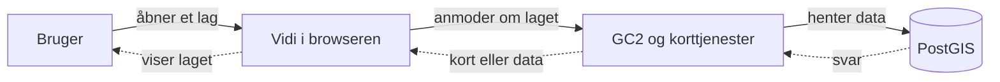
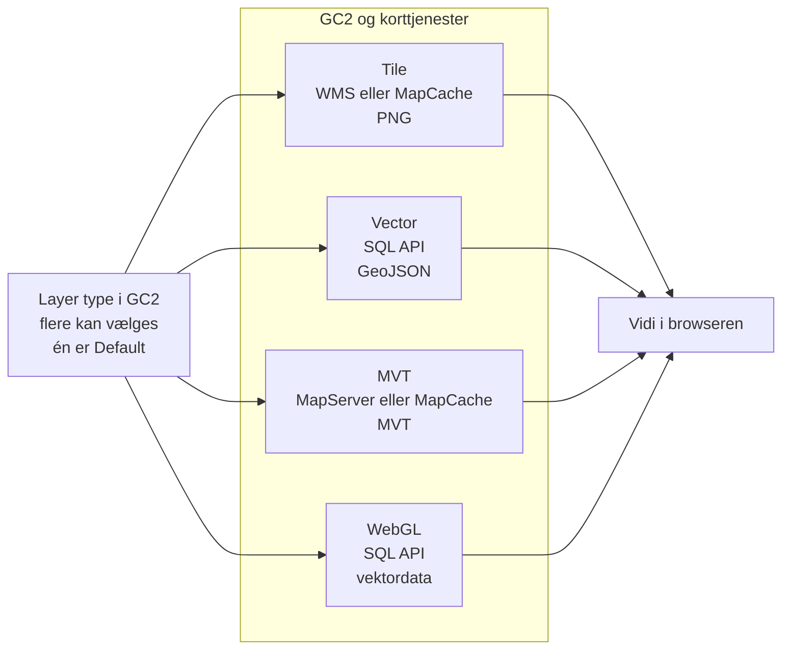

Denne side er til dig, der vil forstå, hvad der teknisk sker mellem en lagindstilling i GC2 og det kort, brugeren ser i Vidi. Du behøver ikke kende hele stakken for at administrere lag. Brug siden som opslagsværk, når du skal vælge lagtype, fejlfinde en visning eller planlægge driften.

:::note[Samme geodata kan vises på flere måder]
Et vektorlag i PostGIS kan leveres som et færdigtegnet kortbillede, GeoJSON, MVT eller data til WebGL. Valget ændrer ikke den oprindelige tabel i PostgreSQL. Det ændrer vejen gennem systemet, svarets format og hvor laget bliver tegnet.
:::

## Dataflow

Brugeren starter forløbet ved at tænde et lag i Vidi. Vidi aflæser lagets tilgængelige og foretrukne **Layer type** fra GC2 og vælger den tilsvarende leveringsvej. Alle veje ender i browseren, men de bruger ikke nødvendigvis MapServer eller det samme dataformat.



Figuren er bevidst forenklet. **Korttjenester** dækker her over GC2s API'er, MapServer og MapCache. De fuldt optrukne pile viser forespørgslen frem til dataene, mens de stiplede pile viser resultatet tilbage til brugeren.

## GC2 og korttjenester

Under **Layer type** i GC2 kan flere typer aktiveres for samme lag. **Default** angiver den type, Vidi normalt bruger, når en konfiguration, URL eller gemt tilstand ikke allerede har valgt en bestemt type. Standardvalget i den aktuelle GC2- og Vidi-kode er `Tile (t)`.

Layer type bestemmer både, hvilken GC2-tjeneste Vidi bruger, hvad der sendes til browseren, og hvor laget tegnes:



Figuren viser kun hovedvejene. WFS er ikke med, fordi WFS ikke er en Layer type i Vidi.

| Valg i Meta | Præfiks | Svar til browseren | Laget tegnes primært af |
|---|---|---|---|
| Tile | `t:` | PNG-kortbilleder fra WMS eller tile cache | MapServer på serveren |
| Vector | `v:` | GeoJSON med geometrier og attributter | Leaflet i browseren |
| MVT | `mvt:` | Tiledelte vektordata | Leaflet VectorGrid i browseren |
| WebGL | `w:` | Vektordata egnet til WebGL | Leaflet.glify/WebGL i browseren |

Valgene foretages under [Meta – Layer type](/gc2/skemaindstillinger/database/meta#layer-type). En Vidi-konfiguration kan desuden vælge en bestemt type med et præfiks i `activeLayers`.

### Tile

`Tile (t)` er standardtypen i den aktuelle GC2-kode. I Vidi betyder det, at browseren modtager færdigtegnede rasterbilleder, normalt PNG, selv om kildelaget består af vektorobjekter i PostGIS.

:::note[WMS arbejder i baggrunden]
Når brugeren tænder et Tile-lag, sender Vidi og Leaflet WMS-anmodninger i baggrunden. Uden cache tegner MapServer et nyt PNG-svar. Med cache kan MapCache returnere et allerede gemt PNG-felt og kun kontakte MapServer ved et cache-miss. Slutbrugeren ser blot laget i kortet og behøver ikke kende WMS-adressen.
:::

WMS er altså en tjeneste til at bestille kortbilleder, mens tile cache er et valgfrit lager af tidligere fremstillede billeder. MapCache kan også udstille de cachede felter gennem WMTS, TMS og XYZ-lignende adresser. Mapfilen fortæller MapServer, hvilken PostGIS-tabel der skal læses, og hvordan resultatet skal tegnes.

**Use tile cache** er en separat indstilling under Meta og er som udgangspunkt slået fra for et nyt lag. Tile er altså standardtypen, men tile cache er ikke automatisk aktiveret. I produktion er cache ofte nyttig til stabile lag, som mange brugere ser i de samme udsnit og målforhold. Dynamiske eller filtrerede lag kræver en mere forsigtig cache-strategi.

Forløbet er:

1. Brugeren tænder laget eller flytter kortet.
2. Leaflet beregner det synlige udsnit og sender en WMS- eller tile-anmodning gennem GC2.
3. Hvis cachen indeholder feltet, returnerer MapCache det eksisterende billede.
4. Ved et cache-miss vælger GC2 mapfilen, og MapServer henter data fra PostGIS.
5. MapServer anvender klasser, symboler og labels og rasteriserer resultatet, typisk til PNG. Resultatet kan derefter gemmes i cachen.
6. Leaflet placerer billedet i kortet. Ved zoom eller panorering hentes billeder for det nye udsnit.

Hvis tile cache er aktiveret, kan MapCache genbruge tidligere fremstillede billedfelter. Det ændrer ikke hovedprincippet: browseren modtager billeder og ikke de oprindelige geometrier.

:::tip[Det brugeren oplever]
Tile er velegnet, når laget skal se ens ud for alle, eller når MapServer skal håndtere en kompleks styling. Browseren kan ikke selv restyle eller behandle de enkelte objekter, fordi de allerede er tegnet ind i billedet.
:::

### Vector

`Vector (v)` sender de enkelte geografiske objekter til browseren. I den aktuelle Vidi-kode hentes de normalt gennem GC2s `/api/sql`-endpoint og returneres som GeoJSON.

Leaflet tegner derefter punkter, linjer og polygoner i browseren. Det gør klientbaseret styling, klik, fremhævning og redigering muligt. Til gengæld skal browseren hente og behandle geometrierne. Store eller meget detaljerede lag kan derfor være langsommere end Tile eller MVT og bør testes ved realistisk datamængde.

:::note[Vector er ikke WFS]
Vidis Vector-type og WFS kan begge levere geografiske objekter, men de er forskellige adgangsveje. Vidis almindelige Vector-visning bruger GC2s SQL API og GeoJSON; den er ikke en skjult WFS-anmodning.
:::

### MVT

`MVT (mvt)` står for **Mapbox Vector Tiles**. Geometrien opdeles efter kortniveau og geografiske felter, så browseren kun henter de vektortiles, som er relevante for det aktuelle udsnit.

Vidis almindelige MVT-overlay tegnes klientbaseret med Leaflet VectorGrid. Det giver browseren adgang til vektorgeometrien i de hentede felter og er ofte bedre egnet til større datamængder end én samlet GeoJSON-leverance. Styling og interaktion skal dog være tilpasset MVT-laget.

MapLibre bruges særskilt i Vidi til konfigurerede MVT-baggrundskort. Et MVT-overlay fra GC2 og et MapLibre-baggrundskort bruger derfor ikke nødvendigvis samme konfiguration eller renderer.

### WebGL

`WebGL (w)` henter vektordata gennem GC2s SQL API og tegner dem med Leaflet.glify og browserens WebGL-understøttelse. WebGL flytter meget af tegnearbejdet til grafikkortet og kan være nyttigt til lag med mange simple objekter.

WebGL er ikke automatisk det bedste valg til alle store lag. Styling, labels, redigering og klikadfærd er anderledes end for almindelige Leaflet-vektorer. Kontrollér derfor både udseende, interaktion og svartider, før typen gøres til standard.

### Tjenester og WFS

Dialogen **Tjenester** i GC2 viser adresser, som programmer kan bruge til at hente data og kort. Den samler flere forskellige adgangsveje:

| Tjeneste i GC2 | Typisk anvendelse |
|---|---|
| OWS med WMS og WFS | WMS leverer kortbilleder; WFS leverer geografiske objekter til eksempelvis QGIS |
| WFS-T | Redigering af objekter gennem en klient, der understøtter transaktionel WFS |
| Tile Map Service | WMTS, TMS og Google/XYZ-lignende tiles fra MapCache |
| SQL API | Forespørgsler brugt af blandt andet Vidis Vector- og WebGL-visning |

Tjenesterne er altså ikke kun til eksterne programmer. Vidi bruger selv WMS, MapCache og SQL API som interne leveringsveje. Slutbrugeren ser normalt blot laget i kortet; tjenesten kan først ses som en URL i browserens Network-panel.

**Web Feature Service (WFS)** er en OGC-standard, som leverer geografiske objekter og attributter til eksempelvis QGIS eller andre integrationssystemer. GC2 kan udstille WFS gennem MapServer.

WFS er relevant, når en ekstern klient skal forespørge eller hente de egentlige objekter gennem en standardiseret tjeneste. Det er ikke den leveringsvej, Vidi bruger, når et lag er valgt som `Vector (v)`.

Den praktiske forskel er:

- WMS leverer færdigtegnede kortbilleder.
- WFS leverer objekter gennem en OGC-tjeneste.
- Vidis Vector-type leverer GeoJSON gennem GC2s SQL API.
- MVT leverer kompakte, tiledelte vektordata.

## Styling

GC2s almindelige klassebaserede kortstyling følger MapServers konfigurationsmodel. Indstillinger i GC2 bliver omsat til elementer som `CLASS`, `STYLE`, `LABEL`, symboler, expressions og målestoksgrænser i en mapfile. MapServer fortolker dem, når et Tile/WMS-lag tegnes.

Ikke alle lag tegnes af MapServer:

| Leveringsform | Hvor tegnes laget? | Hvor kommer stylingen typisk fra? |
|---|---|---|
| Tile/WMS fra GC2 | MapServer på serveren | GC2s kort- og klasseopsætning, omsat til en mapfile |
| Vector via GC2s SQL API | Leaflet i browseren | Vidis klientbaserede vektorindstillinger og metadata |
| MVT-overlay | Leaflet VectorGrid i browseren | Klientbaserede indstillinger til MVT-laget |
| MVT-baggrundskort | MapLibre i browseren | Den konfigurerede MapLibre-style |
| QGIS-projektlag | QGIS Server | QGIS-projektets styling |
| Ekstern WMS | Den eksterne kortserver | Den eksterne tjenestes styling |

Det betyder, at en stylingændring i GC2s almindelige kortmodul først og fremmest påvirker MapServer-visningen. Kontrollér den valgte Layer type, hvis laget ser forskelligt ud mellem Tile, Vector og MVT.

## PostgreSQL og settings

En GC2-geodatabase indeholder både organisationens geodata og et `settings`-skema med GC2s konfiguration. Tabellen `settings.geometry_columns_join` knytter et lag til blandt andet titel, beskrivelse, laggruppe, rettigheder, Meta-indstillinger, klasseinddeling og tile-indstillinger.

Nøglen identificerer normalt laget som `skema.tabel.geometrikolonne`. Når en administrator ændrer et lag i GC2, opdaterer GC2 de relevante værdier i `settings`-skemaet. Tabellen bør behandles som applikationsdata og indgå i samme backup- og restore-procedure som geodataene.

:::caution[Redigér normalt gennem GC2]
Direkte SQL-ændringer i `settings` kan omgå validering og afledte filer. Brug normalt GC2s brugergrænseflade eller dokumenterede API'er, og brug kun direkte databaseændringer, når den konkrete versions datamodel er undersøgt.
:::

GC2 kan desuden gemme uploadede QGIS-projekter som XML i `settings.qgis_files`. Når projekterne skal bruges af QGIS Server, skrives de ud som runtime-filer i GC2-miljøet. QML-indhold og andre lagrelaterede stylingoplysninger kan også være knyttet til laget i `settings`-skemaet.

En fuld tabel-for-tabel-reference er ikke en del af denne introduktion. Ved databasearbejde er GC2-versionens installations-SQL og migrationer den autoritative beskrivelse.

## Mapfiler og QGIS-projekter

Ud fra databaseindstillingerne genererer GC2 filer, som MapServer eller QGIS Server skal kunne læse under drift:

| Indhold | Normal placering | Rolle |
|---|---|---|
| WMS-mapfiler | `app/wms/mapfiles/<database>_<skema>_wms.map` | MapServers WMS-konfiguration for skemaet |
| WFS-mapfiler | `app/wms/mapfiles/<database>_<skema>_wfs.map` | MapServers WFS-konfiguration for skemaet |
| QGIS-projektfiler | `app/wms/qgsfiles/` | Runtime-kopier, som QGIS Server kan læse |
| Midlertidige mapfiler | `app/tmp/*.map` | Filer til enkelte forespørgsler; ikke varig konfiguration |

I GC2s lokale udviklingsmiljø er repositoryet normalt monteret i containeren. De genererede mapfiler kan derfor typisk findes som:

```text
På værtsmaskinen: geocloud2/app/wms/mapfiles/
I GC2-containeren: /var/www/geocloud2/app/wms/mapfiles/
```

Mapfilerne kan genskabes ud fra databasekonfigurationen, blandt andet når et skema indlæses eller relevante lagindstillinger gemmes. Gendannelsen er dog ikke nødvendigvis automatisk ved containerstart. MapServer skal fortsat kunne læse filerne, mens tjenesten kører.

:::note[Kilde og runtime-fil]
PostgreSQLs `settings`-skema er den varige kilde til GC2-konfigurationen. Mapfiler og udskrevne QGIS-projekter er runtime-filer. En produktionsopsætning skal enten bevare dem på persistent storage eller regenerere dem kontrolleret efter deployment og genstart.
:::

Mapfiler kan indeholde tekniske databaseforbindelsesoplysninger. Mappen må ikke publiceres gennem webserveren eller lægges i Git. Manuelle ændringer kan desuden blive overskrevet af GC2. Brug filerne til fejlsøgning, men vedligehold normalt lag og styling gennem GC2.

Se [Installation og opstart](/gc2/installation-og-opstart#håndtér-mapfiler-i-produktion) for krav til storage i produktion og [Admin-drift og fejlsøgning](/gc2/admin-drift-og-fejlsoegning) for de første driftskontroller.

## Næste skridt

- [Meta](/gc2/skemaindstillinger/database/meta)
- [Data, lag og baggrundskort](/gc2/konfigurationer/data-lag-og-baggrundskort)
- [Installation og opstart](/gc2/installation-og-opstart)
- [QGIS og eksterne datakilder](/gc2/qgis-og-eksterne-datakilder)
- <a href="https://github.com/mapcentia/geocloud2" target="_blank" rel="noopener noreferrer">GeoCloud2-kildekode</a>
- <a href="https://github.com/mapcentia/vidi" target="_blank" rel="noopener noreferrer">Vidi-kildekode</a>
