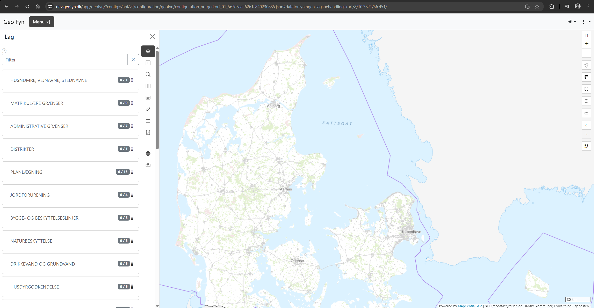
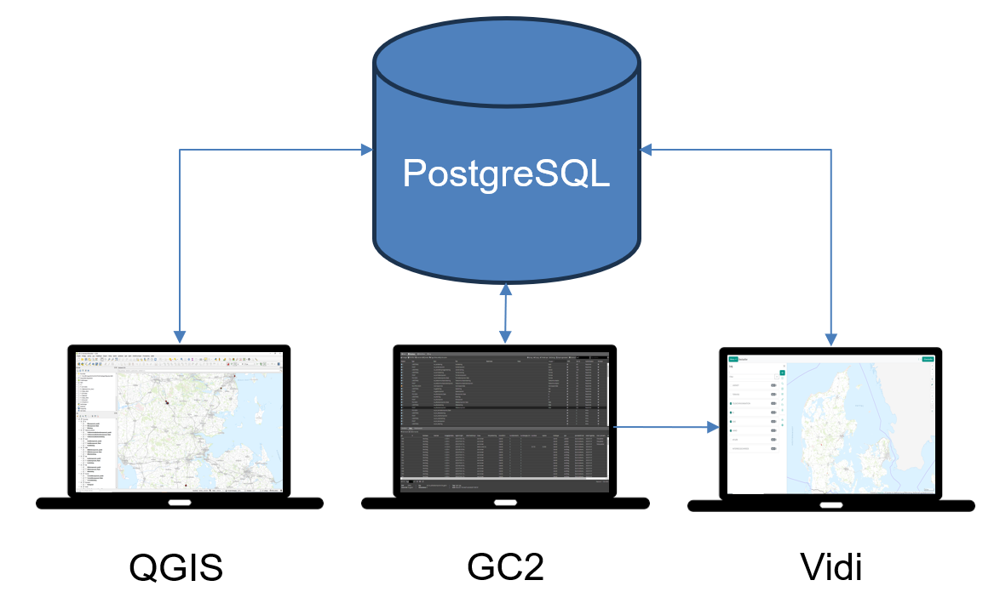

**Forfatter:** [Martin Høgh](mailto:mh@mapcentia.com), [Henrik Larsen](mailto:hbl@geopartner.dk), [Rene Giovanni](mailto:rgb@geopartner.dk)

## Hvad er Vidi?

Vidi er en moderne webbaseret kortapplikation, der gør det nemt at se, søge i og arbejde med geografiske data direkte i din browser. 

Med Vidi kan du:
- **Udforske kort** med baggrundskort, luftfotos og tematiske lag
- **Søge** efter adresser, matrikler og steder
- **Tegne og måle** direkte på kortet
- **Udtrække data** og gemme dem i forskellige formater
- **Lave print** til PDF med dit eget kortudsnit
- **Forespørge** på kortdata med avancerede værktøjer

Vidi kræver ingen installation – det hele foregår i browseren, uanset om du bruger computer, tablet eller mobil.

*Geo Fyn Vidi eksempel*

:::tip[Godt at vide]
Vidi kan se lidt forskelligt ud afhængig af opsætningen. Nogle organisationer bruger en standard visning med fuld funktionalitet, mens andre bruger en mere simpel "indlejret" visning. Funktionerne er de samme, men placeringen af knapper og menuer kan variere.
:::

## Hvordan hænger Vidi og GC2 sammen?

Vidi er kortviseren – det du ser og arbejder med i din browser. Men bag Vidi står GC2 (GeoCloud2), som er administrationsmodulet, der styrer hvilke kort og data der vises.

Tænk på det som:
- **Vidi** = Kortviseren (hvad brugeren ser)
- **GC2** = Kontrolpanelet (hvor data og indstillinger administreres)
- **PostgreSQL-database** = Datalagringsstedet (hvor alle kortdata gemmes)
- **QGIS (eller andet GIS-software)** = Professionelt redigeringsværktøj til avanceret databehandling

*Sammenhængen mellem Vidi, GC2, databasen og GIS-software*

Når du åbner et kort i Vidi, henter systemet automatisk data fra databasen via GC2. Alle indstillinger – som hvilke lag der skal vises, hvordan de skal se ud, og hvilke søgefunktioner der er tilgængelige – er sat op i GC2.

For mere avanceret redigering og databehandling kan du bruge professionelle GIS-værktøjer som QGIS. Disse programmer kan forbinde direkte til PostgreSQL-databasen, så du kan arbejde med data i et fuldt GIS-miljø. Ændringer du laver i QGIS vises automatisk i Vidi, da de arbejder på samme database.

Som almindelig bruger behøver du ikke bekymre dig om GC2 eller QGIS. Men hvis du skal administrere kort eller redigere data professionelt, vil du få adgang til disse værktøjer. Der kan du læse mere i [GC2-dokumentationen](/gc2/).

## Prøv Vidi

Du kan afprøve Vidi her:

- **GeoFyn Borgerkort**: [https://dev.geofyn.dk/app/geofyn/](https://dev.geofyn.dk/app/geofyn/?config=/api/v2/configuration/geofyn/configuration_borgerkort_01_5e7c7aa26261c840230885.json)
- **GeoDanmark GeoFa-kort**: [https://geofa-kort.geodanmark.dk/app/fkg/](https://geofa-kort.geodanmark.dk/app/fkg/?config=/api/v2/configuration/fkg/configuration_fkg_udgivet_5f465f5d3181f687353260.json)

## Om MapCentia

Vidi er udviklet af [MapCentia](https://www.mapcentia.com), et dansk firma specialiseret i open source GIS-løsninger. MapCentia står også bag GC2 (GeoCloud2), som er den platform der leverer kortdata til Vidi.

MapCentia's løsninger bruges af kommuner, forsyninger, regioner og private virksomheder til at håndtere og dele geografiske data på en effektiv og sikker måde.

## For udviklere og teknisk interesserede

Vidi er open source og udvikles aktivt på GitHub:

- **GitHub repository**: [https://github.com/mapcentia/vidi](https://github.com/mapcentia/vidi)
- **Changelog**: [https://github.com/mapcentia/vidi/blob/master/CHANGELOG.md](https://github.com/mapcentia/vidi/blob/master/CHANGELOG.md)

## Kom godt i gang

Brug menuerne til venstre for at udforske Vidi's funktioner. Vi anbefaler at starte med de grundlæggende værktøjer og arbejde dig videre til de mere avancerede funktioner.