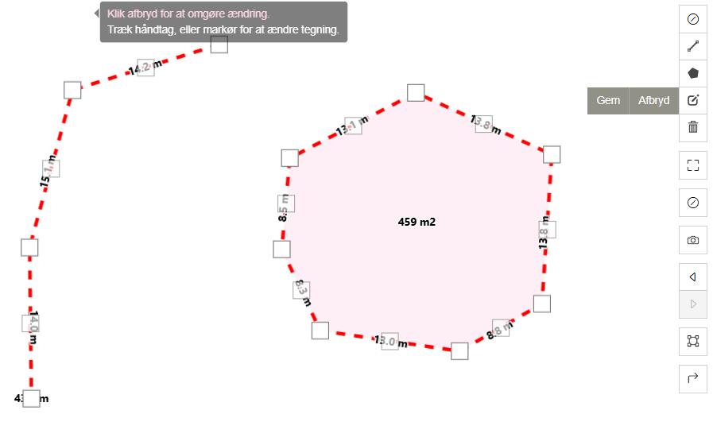
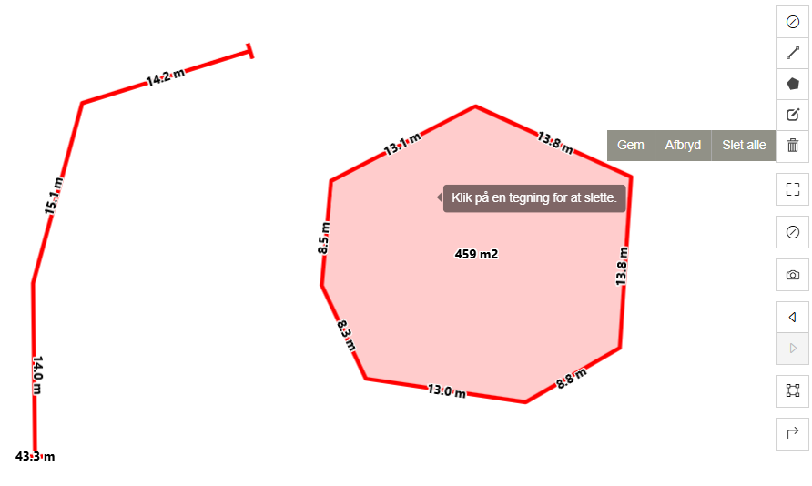

import maaleLinjeImg from '../resources/vaerktojslinjen-vidi-maalevaerktoj-linje.png';
import maaleLinjeResultatImg from '../resources/vaerktojslinjen-vidi-maalevaerktoj-linje-resultat.png';
import maaleFladeImg from '../resources/vaerktojslinjen-vidi-maalevaerktoj-flade.png';
import maaleFladeResultatImg from '../resources/vaerktojslinjen-vidi-maalevaerktoj-flade-resultat.png';

**Forfatter:** [Henrik Larsen](mailto:hbl@geopartner.dk), [Rene Giovanni](mailto:rgb@geopartner.dk)

Vidi har en række værktøjer, der gør det nemt at foretage forskellige typer af geometriske målinger (redlining) i kortet.

:::tip[Godt at vide]
Målinger vil også fremgå på PDF-print, så du kan dokumentere dine målinger.
:::

## Hvad er måleværktøjet?

Måleværktøjet gør det muligt at måle afstande og arealer direkte på kortet. Du kan tegne linjer for at måle afstande mellem punkter eller tegne polygoner for at beregne arealer. Værktøjet viser automatisk resultatet i forskellige enheder.

:::caution[Vigtigt: Måleværktøj ≠ Tegneværktøj]
Vidi har **to forskellige** tegneværktøjer:

- **Måleværktøjet** (i værktøjslinjen til højre) – til målinger med automatisk beregning
- **Tegneværktøjet** (i Vidi-menuen til venstre) – til generel tegning på kortet

Disse værktøjer er **ikke kompatible**. Du kan kun ændre eller slette objekter i det værktøj, hvor de blev oprettet. Målinger lavet med måleværktøjet kan ikke redigeres med tegneværktøjet, og omvendt.

[Læs mere om tegneværktøjet →](/vidi/vidi-menuen/tegnevaerktoj)
:::

## Aktiver måleværktøjet

1. Klik på **lineal-ikonet** i værktøjslinjen (blå boks)
2. Når værktøjet aktiveres så forsvinder lineal ikonet og der vises nye ikoner (rød boks)

*Måleværktøjer i højre side af kortet, når knap i blå boks trykkes på så dukker værktøjer i den røde boks frem*

Der vil være følgende værktøjer:

- **Luk måleværktøj** – Deaktiver måleværktøjet
- **Tegn en linje** – Mål afstande
- **Tegn en flade** – Mål arealer
- **Ændre tegning** – Rediger eksisterende målinger
- **Slet tegning** – Fjern målinger

## Mål afstand (linje)

Når måleværktøjet er aktiveret, kan du måle afstande ved at klikke på flere punkter i kortet.

### Sådan måler du en afstand

1. **Klik på Tegn en linje ikonet**
2. **Klik på startpunktet** for målingen
3. **Klik på næste punkt** – der tegnes en linje, og afstanden vises
4. **Fortsæt med at klikke** for at tilføje flere punkter (afstanden beregnes løbende)
5. **Klik på Afslut** eller **klik på det sidst tilføjede punkt** for at afslutte målingen

:::tip[Nyttigt]
Brug **"Slet sidste punkt"**-knappen hvis du kommer til at placere et punkt forkert.
:::

<figure class="centered-figure">
  
  <figcaption>Mål afstande ved at klikke på flere punkter</figcaption>
</figure>

### Aflæsning af resultatet

Afstanden vises automatisk både:
- **Ved hvert segment** (afstand mellem to punkter)
- **Som samlet længde** ved slutpunktet

Enheder vises i:
- **Meter (m)** eller **kilometer (km)** for korte/lange afstande

<figure class="centered-figure">
  
  <figcaption>Resultatet afstandsmåling</figcaption>
</figure>

## Mål flade (areal)

For at måle et areal tegner du en polygon (lukket flade) på kortet.

### Sådan måler du et areal

1. **Klik på Tegn en flade ikonet**
2. **Klik på startpunktet** for polygonen
3. **Klik på flere punkter** for at tegne polygonens kanter
4. **Klik på startpunktet** for at lukke polygonen
5. Arealet beregnes automatisk og vises i polygonen

:::tip[Nyttigt]
Brug **"Slet sidste punkt"**-knappen hvis du kommer til at placere et punkt forkert.
:::

<figure class="centered-figure">
  
  <figcaption>Mål arealer ved at tegne en polygon</figcaption>
</figure>

### Aflæsning af areal

Arealet vises automatisk i passende enheder:
- **Kvadratmeter (m²)** for små arealer
- **Kvadratkilometer (km²)** og **Hektar (ha)** for store arealer

<figure class="centered-figure">
  
  <figcaption>Resultatet arealmåling</figcaption>
</figure>

## Rediger eksisterende målinger

Når du har lavet en måling, kan du redigere den ved at flytte punkterne.

:::note[Bemærk]
Kun målinger lavet med **måleværktøjet** kan redigeres her. Tegninger lavet med tegneværktøjet skal redigeres i menuen.
:::

### Sådan redigerer du en måling

1. **Klik på ændre tegning ikonet**
2. **Knudepunkter fremhæves** (hvide kasser)
3. **Træk i et knudepunkt** for at flytte det
4. **Klik i midten af en linje** for at tilføje et nyt knudepunkt
5. **Klik på Gem** for at gemme ændringer
6. **Klik på Fortryd** for at annullere alle ændringer

*Træk i punkter for at justere målingen*

:::note[Bemærk]
Ændringer i målingen opdaterer automatisk beregningen af afstand eller areal.
:::

## Slet målinger

Du kan slette individuelle målinger eller alle målinger på én gang.

:::note[Bemærk]
Kun målinger lavet med **måleværktøjet** kan slettes her. Tegninger lavet med tegneværktøjet i menuen slettes på en anden måde.
:::

### Slet målinger

1. **Klik på skraldespands ikonet**
2. **Klik på den måling** du vil slette
3. **Klik på Gem** for at bekræfte sletningen
4. **Klik på Afbryd** for at annullere sletningen
5. **For at slette alle målinger** – klik på "Slet alle"

*Slet individuelle målinger eller alle på én gang*

:::caution[Vigtigt]
Hvis du klikker **"Slet alle"**, fjernes alle målinger øjeblikkeligt uden bekræftelse.
:::

## Deaktiver måleværktøjet

For at deaktivere måleværktøjet:

- Klik på **lineal-ikonet** igen
- Eller vælg et andet værktøj fra værktøjslinjen

Dine målinger forbliver synlige på kortet, indtil du sletter dem, ryder kortet, eller nulstiller kortet.

## Tips og tricks

### Præcise målinger
- **Zoom ind** for mere præcise placeringer af målepunkter
- **Brug mange punkter** når du måler langs buede eller irregulære former
- Jo flere knudepunkter, desto mere præcist bliver resultatet

### Gem dine målinger
Målinger forsvinder når du genindlæser kortet, medmindre du gemmer dem i et projekt. [Læs mere om projekter →](/vidi/vidi-menuen/projekter)

:::tip[Professionel tip]
Hvis du skal måle mange arealer eller afstande regelmæssigt, kan det være en fordel at bruge GIS-software som QGIS, hvor du kan gemme målingerne permanent og lave mere avancerede analyser.
:::

