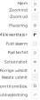

**Forfatter:** [Henrik Larsen](mailto:hbl@geopartner.dk)

Værktøjslinjen i Vidi findes typisk i højre side af kortvinduet og indeholder de mest brugte kortværktøjer. Her kan du hurtigt tilgå funktioner til navigation, måling, placering og kortadministration.

*Værktøjslinjen placeret til højre i kortvinduet*

:::tip[Godt at vide]
Værktøjslinjens placering og udseende kan variere lidt, afhængig af den valgte Vidi-konfiguration.
:::

## Tilgængelige værktøjer

### Navigation
Værktøjer til at navigere rundt i kortet:
- **Hjem** – Gå tilbage til kortets startudsnit
- **Zoom ind (+)** – Zoom tættere på kortet
- **Zoom ud (−)** – Zoom længere væk fra kortet
- **Zoom til område** – Træk en firkant for at zoome til et specifikt område
- **Forrige udsnit (&lt;)** – Gå tilbage til tidligere kortudsnit
- **Næste udsnit (&gt;)** – Gå frem til næste kortudsnit
- **Fuld skærm** – Vis kortet i fuld skærm

[Læs mere om navigation →](../navigation)

### Placering og rutevejledning
- **Find mig** – Brug din enheds placeringstjeneste til at vise din position på kortet
- **Vejvisning** – Få rutevejledning direkte i kortet (kræver extension)

[Læs mere om placering og rutevejledning →](../placering)

### Måleværktøj
Mål afstande og arealer direkte på kortet. Du kan:
- Måle afstande mellem punkter
- Måle arealer ved at tegne polygoner
- Redigere og slette dine målinger

[Læs mere om måleværktøj →](../maalevaerktoj)

### Kortadministration
- **Ryd kortet** – Fjern alle tegninger, målinger og andre midlertidige objekter fra kortet
- **Screenshot** – Tag et øjebliksbillede af det aktuelle kortudsnit

[Læs mere om kortadministration →](../kortadministration)

## Extensions (udvidelser)

Vidi kan udvides med ekstra funktionalitet gennem extensions. Disse er ikke aktiveret som standard, men kan tilføjes efter behov.

[Læs mere om tilgængelige extensions →](/vidi/extensions/oversigt)
