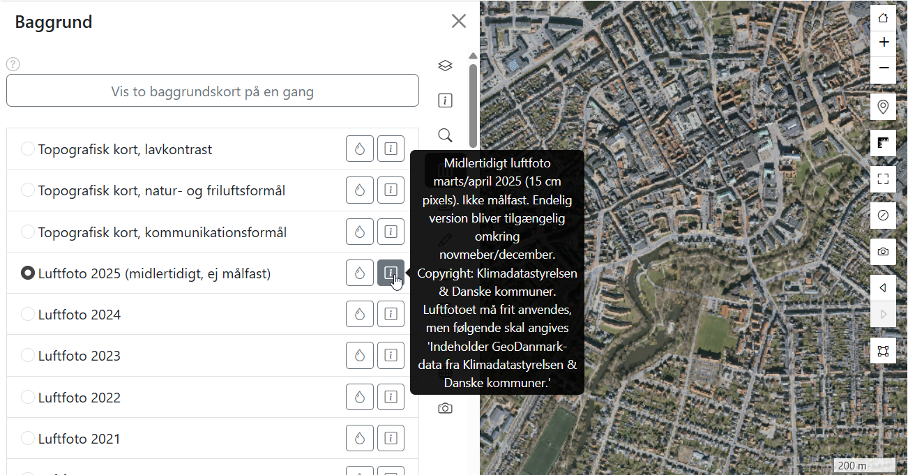
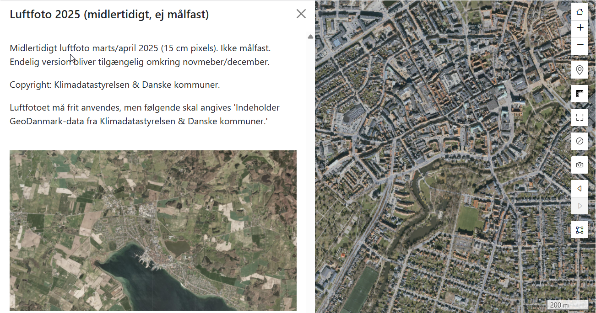

import baggrundskortValgImg from '../resources/vidi-menu-baggrundskort-valg.gif';
import baggrundskortTransparensImg from '../resources/vidi-menu-baggrundskort-transparens.gif';
import baggrundskortSliderImg from '../resources/vidi-menu-baggrundskort-slider.gif';
import baggrundskortOverlapImg from '../resources/vidi-menu-baggrundskort-overlap.gif';

**Forfatter:** [Henrik Larsen](mailto:hbl@geopartner.dk), [Rene Giovanni](mailto:rgb@geopartner.dk)

## Hvad er baggrundskort?

Baggrundskort er de basiskort, der vises under dine datalag. De giver kontekst og orientering og kan vise forskellige typer information som luftfotos, topografiske kort eller simple basiskort.

## Valg af baggrundskort

### Skift baggrundskort

1. Klik på **baggrundskort-ikonet** i Vidi-menuen
2. **Vælg et baggrundskort** fra listen
3. Kortet skifter til det valgte baggrundskort

<figure class="centered-figure">
  
  <figcaption>Eksempel på valg af baggrundskort</figcaption>
</figure>

### Tilgængelige baggrundskort

Hvilke baggrundskort der er tilgængelige, afhænger af din Vidi-konfiguration. Typiske eksempler:

- **Topografisk kort** - Traditionelt kort med veje, bygninger, terræn
- **Luftfoto** - Satellitbilleder eller flyfoto
- **Skærmkort** - Simpelt, kontrasterende kort
- **Historiske kort** - Ældre kort til sammenligning
- **OpenStreetMap** - Åbent fællesskabskort

:::note[Konfiguration]
Baggrundskort konfigureres i GC2's kørselskonfiguration.

[Læs mere om kørselskonfigurationer i GC2 →](/gc2/) (kommer snart)
:::

## Info om baggrundskort

### Se baggrundskort-info

1. Hold musen over <MenuPath items=" i " /> **info-ikonet** ved baggrundskortet for at se tooltip
2. Klik på <MenuPath items=" i " /> **info-ikonet** ved baggrundskortet for at se en detaljeret beskrivelse, f.eks.:
  - **Beskrivelse** af baggrundskortet
   - **Kilde** og **copyright**
   - **Opdateringsdato**
   - **Links** til mere information

*Vidi-menuen - info om baggrundskort*

*Vidi-menuen - info om baggrundskort - detaljeret visning*

## Gennemsigtighed

Du kan justere gennemsigtigheden for hvert baggrundskort individuelt.

### Juster gennemsigtighed

1. Find baggrundskortet i listen
2. Tryk på **dråbe**-ikonet
3. Træk i **gennemsigtighedsskyderen**
4. Baggrundskortet bliver mere eller mindre gennemsigtigt

<figure class="centered-figure">
  
  <figcaption>Eksempel på tilføjelse af transparens til baggrundskort</figcaption>
</figure>

:::tip[Nyttigt]
Sæt gennemsigtighed til 50–70 % for at få dine lag til at fremstå tydeligere i kortet.
:::

## Sammenligning af baggrundskort

Vidi har to måder at sammenligne baggrundskort på: **vertikal slider** og **horisontal slider (overlay)**.

For at åbne funktionen skal du trykke på <MenuPath items="Vis to baggrundskort på en gang" />.

### Slider

Vis to baggrundskort side om side med en vertikal opdeling:

1. Tryk på <MenuPath items="Slider" />
2. Der vises to kolonner med radioknapper. Vælg ét baggrundskort i venstre kolonne og ét i højre kolonne
3. En vertikal **slider** vises i midten af kortet
4. **Træk slideren** for at se mere af det ene eller andet kort

<figure class="centered-figure">
  
  <figcaption>Eksempel på slider</figcaption>
</figure>

**Anvendelse:**
- Sammenlign historiske kort med moderne
- Se forskel mellem luftfoto og topografisk kort
- Kvalitetstjek mellem forskellige datakilder

### Overlap

Overlæg to baggrundskort med justerbar gennemsigtighed:

1. Tryk på <MenuPath items="Overlap" />
2. En horisontal **slider** vises
3. Der vises to kolonner med radioknapper. Vælg ét baggrundskort i venstre kolonne og ét i højre kolonne
4. **Træk slideren:**
   - **Midten:** ca. 50% transparens for begge lag
   - **Venstre:** mere af venstre kort
   - **Højre:** mere af højre kort

<figure class="centered-figure">
  
  <figcaption>Eksempel på overlap</figcaption>
</figure>

**Anvendelse:**
- Blande topografisk kort med matrikelkort
- Se gradvis overgang mellem to tidsperioder
- Sammenligne forskellige tolkninger af samme område