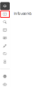

import infovaerktojGrundlaeggendeImg from '../resources/vidi-menu-infovaerktoj-grundlaeggende.gif';
import infovaerktojAttributtabelImg from '../resources/vidi-menu-infovaerktoj-attributtabel.gif'; 
import infovaerktojAvanceretImg from '../resources/vidi-menu-infovaerktoj-avanceret-soegning.gif';
import infovaerktojVirtuelLagImg from '../resources/vidi-menu-infovaerktoj-virtuellag.png';

**Forfatter:** [Henrik Larsen](mailto:hbl@geopartner.dk), [Rene Giovanni](mailto:rgb@geopartner.dk)

## Hvad er infoværktøjet?

Infoværktøjet gør det muligt at klikke på features (objekter) på kortet og få detaljeret information om dem. Du kan se attributter, redigere features (hvis konfigureret), og udføre avancerede søgninger med buffere.

*Vidi-menuen - lagstyring*

## Hent info på features

Det er muligt at hente info på en eller flere features og få det vist i kortet via info-pop og en attributtabel.

## Info-popup

1. Klik på **info-ikonet** i Vidi-menuen
2. **Klik på en feature** på kortet
3. En **info-popup** vises med information om featuren

<figure class="centered-figure">
  
  <figcaption>Info-popup</figcaption>
</figure>

:::note[Bemærk]
Hvordan info-popup'en ser ud, kan konfigureres i GC2. Standard-visningen af attributter vises i en tabel i vidi-menuen.

[Læs mere om styling af info-popup i GC2 →](/gc2/)
:::

**Info-popup indhold**

Info-popup'en kan vise:
- **Attributterfelter**
- **Billeder** og **links**
- **Formateret tekst** (HTML)

Info fra popup'en vises også i attributtabellen.

## Attributtabellen ###

Hvis flere features rammes ved info-klik, vises resultatet i en **Attributtabel** i menuen til venstre. Det er derefter muligt i attributtabellen at vælge den feature man ønsker at se info på.

<figure class="centered-figure">
  
  <figcaption>Attributtabellen</figcaption>
</figure>

**Funktioner i attributtabellen**

- **Se features** - overlappende lag vises via lagfaner
- **Zoom til feature** - Klik på en række for at zoome til featuren og få **info-popup**
- **Eksporter til Excel** - Tryk på <MenuPath items="Hent resultat som MS Excel" />

## Avanceret forespørgsel

Avanceret forespørgseler gør det muligt at søge efter features inden for en bestemt geometri (buffer, polygon, linje, osv.). 

<figure class="centered-figure">
  
  <figcaption>Eksempel på brugen af avanceret forespørgsel</figcaption>
</figure>

### Aktiver avanceret søgning

1. Klik på **info-ikonet** i Vidi-menuen
2. Klik på <MenuPath items="Aktivér avanceret forespørgsel" />
3. Tegneværktøjer vises til højre

### Tegneværktøjer ###

Når avanceret søgning er aktiveret, får du adgang til følgende tegneværktøjer:

- **Linje** - Tegn en linje
- **Polygon** - Tegn en polygon
- **Rektangel** - Tegn et rektangel
- **Cirkel** - Tegn en cirkel
- **Markør** - Placer et punkt

*Tegneværktøjer ved avanceret forespørgsel*

### Buffer ###

Du kan tilføje en buffer omkring den tegnede geometri:

1. **Indtast buffer-afstand** (f.eks. 10 meter)
2. **Tegn en geometri** (f.eks. en linje)
3. Features inden for bufferen fremhæves

### Resultat ved avanceret forespørgsel ###
Efter udvælgelsen af features har man nogle forskellige muligheder. Hvis der er flere forskellige lag i forespørgslen, så vil der være lagfaner som man kan vælge.

1. Ved at trykke på <MenuPath items="GeoJSON" /> er det muligt at downloade features som GeoJSON (IETF GIS fil standard)
2. Ved at trykke på <MenuPath items="+ Opret virtuelt lag" /> kan der oprettes et nyt virtuelt lag. Det virtuelle lag bliver oprettet i laggruppen "Virtuelle lag" som er nederst i laggruppestrukturen og eksistere kun hvis der er genereret virtuelle lag.

<figure class="centered-figure">
  
  <figcaption>Virtuelt lag i laggruppen **Virtuelle lag**</figcaption>
</figure>

3. Anvende resultatmenuen

*Resultatmenuen*

 - **Show Card view** - Anden visningsmåde
 - **Kolonner** - Vælge hvilken kolonner som skal vises
 - **Eksporter** - Download resultatet som en af følgende formater:
    - JSON
    - XML
    - CSV
    - TXT
    - SQL
    - MS Excel

:::tip[Nyttigt]
Brug avanceret søgning til at:
- Finde features inden for en specifik radius, f.eks. ved at anvende markør tegneværktøjet
- Identificere features der krydser et område ved at bruge polygon/rektangel tegneværktøjet
- Lave buffer analyser uden professionelt GIS-software
:::

## Redigering af features

Hvis **Editor-udvidelsen** er aktiveret og laget er gjort editerbart, kan du redigere features direkte fra info-popup'en.

1. **Klik på featuren** med infoværktøjet
2. Info-popup vises
3. Klik på **Rediger** eller **Edit**-knappen
4. **Redigér attributter** eller **flyt geometrien**
5. Klik **Gem** for at gemme ændringerne

**📸 BILLEDE/GIF MANGLER:** `vidi-menu-infovaerktoj-rediger.gif`
*Animation af redigering af en feature*

:::caution[Vigtigt: Kræver rettigheder]
For at kunne redigere features skal følgende være opfyldt:
- Editor-udvidelsen skal være aktiveret
- Laget skal være gjort editerbart i GC2
- Du skal have de korrekte rettigheder i GC2

[Læs mere om Editor-udvidelsen →](/vidi/extensions/editor)
:::
