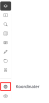

**Forfatter:** [Henrik Larsen](mailto:hbl@geopartner.dk), [Rene Giovanni](mailto:rgb@geopartner.dk)

## Hvad er koordinat-udvidelsen?

Koordinat-udvidelsen gør det muligt at arbejde med koordinater i forskellige koordinatsystemer, se din aktuelle position, og navigere til specifikke koordinater.

*Vidi-menuen - koordinater*

## Aktiver koordinat-udvidelsen

1. Klik på **koordinat-ikonet** i Vidi-menuen
2. Udvidelsen åbnes med koordinat-funktioner

**📸 BILLEDE MANGLER:** `vidi-extensions-koordinater-aktiveret.png`

## Koordinatsystemer

Du kan vælge mellem følgende koordinatsystemer:

### WGS84 - Bredde/Længdegrader

**Decimal grader:**
- Format: `55.6761, 12.5683`
- Bruges til: GPS, internationale systemer

**Grader, minutter, sekunder (DMS):**
- Format: `55°40'34"N, 12°34'06"E`
- Bruges til: Navigation, traditionel kortlæsning

### ETRS89 / UTM32N

- Format: `691875, 6176625`
- Bruges til: Danske geodata, professionel GIS

**📸 BILLEDE MANGLER:** `vidi-extensions-koordinater-systemer.png`

## Se koordinater

### Markør-position

Når du bevæger musen over kortet, vises koordinaterne for markørens aktuelle position i realtid.

**📸 BILLEDE/GIF MANGLER:** `vidi-extensions-koordinater-markør.gif`

### Kortets udstrækning

Du kan se koordinater for kortets hjørner (bounding box):
- **Nordvest-hjørne**
- **Sydøst-hjørne**
- **Centrum-koordinat**

**📸 BILLEDE MANGLER:** `vidi-extensions-koordinater-udstraekning.png`

## Gå til koordinater

Du kan navigere til specifikke koordinater:

1. **Indtast koordinater** i tekstfeltet
2. Format: `X Y` eller `Længde Bredde` (mellemrum eller komma-separeret)
3. **Klik "Gå til"**
4. Kortet zoomer til positionen

**📸 BILLEDE/GIF MANGLER:** `vidi-extensions-koordinater-gaa-til.gif`

:::tip[Formateksempler]
- `691875 6176625` (UTM32N)
- `12.5683, 55.6761` (WGS84 decimal)
- `55.6761 12.5683` (omvendt rækkefølge virker også)
:::

## Kopier koordinater

Du kan kopiere koordinater til udklipsholderen:

1. **Klik på koordinaterne**
2. Koordinaterne kopieres
3. **Indsæt** i andet program (Excel, email, osv.)

**📸 BILLEDE MANGLER:** `vidi-extensions-koordinater-kopier.png`

## Use cases

### Feltarbejde

1. Notér koordinater før afrejse
2. Indtast koordinater i Vidi på tablet
3. Navigér til positionen
4. Dokumentér observationer

### Deling af positioner

1. Find position på kortet
2. Kopier koordinater
3. Del med kolleger via email/chat
4. Kolleger kan navigere til samme position

### Integration med andre systemer

1. Eksportér koordinater fra GIS-system
2. Indtast i Vidi's "Gå til"
3. Verificér position visuelt
4. Dokumentér i rapport

## Tips og tricks

### Præcision

- **WGS84 decimal:** 6 decimaler giver ~10cm præcision
- **UTM32N:** Hele meter-koordinater

### Hurtigt koordinat-kopi

1. Hold musen over position
2. Koordinater vises automatisk
3. Klik for at kopiere
4. Indsæt i andet program

### Konvertering mellem systemer

1. Vælg først system (f.eks. WGS84)
2. Kopier koordinater
3. Skift system (f.eks. UTM32N)
4. Se samme position i andet format

**📸 BILLEDE MANGLER:** `vidi-extensions-koordinater-konvertering.png`

## Fejlfinding

### Koordinater vises ikke?

- Tjek at udvidelsen er aktiveret
- Genindlæs siden
- Kontakt systemadministrator

### "Gå til" virker ikke?

- Tjek koordinat-format
- Verificér at koordinater er gyldige for det valgte system
- Prøv at bytte X og Y rundt
- Brug komma eller mellemrum som separator

### Forkerte koordinater?

- Tjek at du har valgt korrekt koordinatsystem
- Verificér at kortets projektion er korrekt
- Kontakt systemadministrator
