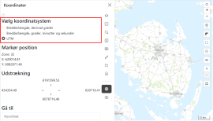

import koordinaterImg from '../resources/vidi-menu-koordinater.gif';
import koordinaterPositionImg from '../resources/vidi-menu-koordinater-position.gif';
import koordinaterUdstraekningImg from '../resources/vidi-menu-koordinater-udstraekning.gif';
import koordinaterPanorerImg from '../resources/vidi-menu-koordinater-pan-to.gif';

**Forfatter:** [Henrik Larsen](mailto:hbl@geopartner.dk)

## Hvad er koordinat-udvidelsen?

Koordinat-udvidelsen gør det muligt at arbejde med koordinater i forskellige koordinatsystemer. Du kan se din aktuelle position, skifte visning mellem formater og navigere til en bestemt koordinat.

*Vidi-menuen - koordinater*

:::note[Extension påkrævet]
Koordinater er en extension der ikke er aktiveret som standard. Kontakt din administrator, hvis du har brug for denne funktion. 

[Læs mere om koordinater extension →](/vidi/extensions/coordinates)
:::

## Åbn koordinat-funktionen

1. Klik på **koordinat-ikonet** i Vidi-menuen
2. Koordinat-panelet åbnes med de tilgængelige funktioner

<figure class="centered-figure">
  
  <figcaption>Koordinater i Vidi-menuen</figcaption>
</figure>

## Koordinatsystemer

Du kan vælge mellem følgende koordinatsystemer. Når du skifter koordinatsystem, opdateres de viste koordinater automatisk.

### WGS84 - Bredde/Længdegrader

**Bredde/længde i decimalgrader:**
- Format: B: `57.04601`, L: `9.94400`
- Bruges til: GPS, internationale systemer

**Bredde/længde i grader, minutter og sekunder (DMS):**
- Format: B: `57°02'45.6" N`, L: `9°56'38.4" E`
- Bruges til: Navigation, traditionel kortlæsning

### ETRS89 / UTM Zone 32N
- Format: X: `557273`, Y: `6322912`
- Bruges til: Danske geodata

*Vidi-menuen - valg af koordinatsystemer*

## Se koordinater

### Markør-position

Når du bevæger musen over kortet, vises koordinaterne for markørens aktuelle position løbende.
<figure class="centered-figure">
  
  <figcaption>Koordinater for markør-position</figcaption>
</figure>

### Kortets udstrækning

Du kan også se koordinaterne for kortets udstrækning (bounding box):
- **Vestligste kant**
- **Østligste kant**
- **Nordligste kant**
- **Sydligste kant**

<figure class="centered-figure">
  
  <figcaption>Koordinater for kortets udstrækning</figcaption>
</figure>

## Gå til koordinater

Du kan navigere til specifikke koordinater:

1. **Indtast koordinater** i tekstfeltet
2. Brug formatet `X Y` eller `Længde Bredde` med mellemrum som separator
3. Formatet skal matche det valgte koordinatsystem
4. Tryk på <Key items="Enter" />, så panorerer kortet automatisk til positionen

<figure class="centered-figure">
  
  <figcaption>Panorer til koordinater</figcaption>
</figure>

:::tip[Formateksempler]
- `55°40'34"N 12°34'06"E` (DMS)
- `57.04601 9.94400` (decimalgrader)
- `557169 6322888` (ETRS89 / UTM Zone 32N)
:::
