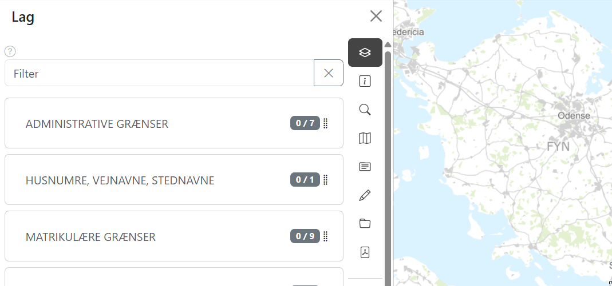
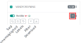

import lagstyringLaggrupperImg from '../resources/vidi-menu-lagstyring-laggrupper.gif';
import lagstyringSoegImg from '../resources/vidi-menu-lagstyring-soeg.png';
import lagstyringGennemsigtighedImg from '../resources/vidi-menu-lagstyring-gennemsigtighed.png';
import lagstyringLabelsImg from '../resources/vidi-menu-lagstyring-labels.png';
import lagstyringFiltreEksImg from '../resources/vidi-menu-lagstyring-filtre.gif';
import lagstyringFilterConfigImg from '../resources/vidi-menu-lagstyring-filter-config.png';
import lagstyringFilterPredefinedImg from '../resources/vidi-menu-lagstyring-filter-predefined.png';
import lagstyringFilterAvanceretImg from '../resources/vidi-menu-lagstyring-filtre-avanceret.gif';
import lagstyringOmrokeringImg from '../resources/vidi-menu-lagstyring-omrokering.gif';
import lagstyringInfoImg from '../resources/vidi-menu-lagstyring-info.gif';
import lagstyringLagFilterImg from '../resources/vidi-menu-lagstyring-lagfilter.gif';
import lagstyringDownloadImg from '../resources/vidi-menu-lagstyring-download.png';

**Forfatter:** [Henrik Larsen](mailto:hbl@geopartner.dk), [Rene Giovanni](mailto:rgb@geopartner.dk)

## Hvad er lagstyring?

Lagstyring i Vidi gør det muligt at styre hvilke kortlag der vises på kortet. Du kan tænde og slukke for lag, organisere dem i grupper, justere hvordan de vises, søge i data, filtrere og downloade.

*Vidi-menuen - lagstyring*

## Tænd og sluk for lag

### Laggrupper

Lag er organiseret i laggrupper.

1. Klik på laggruppen for at folde gruppen ud/ind
2. Klik på **afkrydsningsfeltet** ved gruppenavnet for at tænde/slukke alle lag i gruppen på én gang

:::note[Bemærk]
Afkrydsningsfeltet ved laggruppen er en kørselskonfiguration, kontakt din administrator hvis denne skal tilføjes til jeres opsætning.

[Læs mere om kørselskonfigurationer i GC2 →](/gc2/)
:::

:::tip[Godt at vide]
Laggrupper kan have undergrupper. Fold grupperne ud for at se hele strukturen.
:::

<figure class="centered-figure">
  
  <figcaption>Laggrupper med undergrupper</figcaption>
</figure>

### Tænd enkelt lag

1. Klik på laggruppen hvor laget er placeret – laggruppen udvides og alle lag kan tændes/slukkes
2. Find laget i laggruppen
3. Klik på **afkrydsningsfeltet** ved siden af lagnavnet
4. Laget tændes eller slukkes i kortet

*Laglisten med afkrydsningsfelter*

## Lagfilter

Øverst i lagstyringen, er der et filter som kan bruges til hurtigt at finde et specifikt lag, hvis du ikke kan huske, hvilken laggruppe det er placeret i. Indtast hele eller dele af lagnavnet.

<figure class="centered-figure">
  
  <figcaption>Filtrering af lag</figcaption>
</figure>

:::note[Bemærk]
Visningen begrænses til de laggrupper, der matcher din søgning. For at få vist alle lag igen skal du rydde søgefeltet.
:::

## Info om lag

Der er muligt at opsætte information til hvert lag:

1. Klik på **info-ikonet** ved laget
2. En tooltip for laget vises
3. Hvis der er opsat udvidet information om laget, kan du klikke på **info-knappen** for at få yderligere detaljer

<figure class="centered-figure">
  
  <figcaption>Eksempel på laginformation med tooltip og udvidet beskrivelse</figcaption>
</figure>

:::note[Konfiguration i GC2]
Laginformation konfigureres i GC2 

gennem:
- **Beskrivelse:** Basis beskrivelse af laget
- **Meta CKAN:** Udvidet metadata (description) (slet dette når vi har opsat GC2 dokumentation)

[Læs mere om opsætning af laginformation i GC2 →](/gc2/)
:::

## Omrokering af lag

Du kan ændre rækkefølgen af lag og laggrupper:

1. **Klik og hold** grebsikonet <MenuPath items="⋮⋮" /> på laggruppen eller det enkelte laget
2. **Træk** det til den ønskede position
3. **Slip** for at placere

Lagenes rækkefølge i listen bestemmer også deres visning på kortet:

- Lag øverst i listen vises **øverst** på kortet
- Lag nederst i listen vises **nederst** på kortet

<figure class="centered-figure">
  
  <figcaption>Eksempel på omrokering af lag</figcaption>
</figure>

:::note[Bemærk]
Hvis din webbrowser cache bliver ryddet vil dine valg af lag position blive glemt. Standard rækkefølgen af lag konfigureres i GC2.

[Læs mere om lag konfiguration  i GC2 →](/gc2/)
:::

## Lagmenu

Hvert lag har en menu med avancerede funktioner. Aktiver først laget og klik derefter på <MenuPath items="⋯" /> ved siden af lagnavnet for at åbne menuen.

*Lag-menuen med alle muligheder*

### Søgning i lag

Du kan søge i lagets felter for hurtigt at finde specifikke objekter. Når du aktiverer søgeværktøjet, vises hvilke felter der kan søges i.

1. Klik på <MenuPath items="⋯" /> ved laget
2. Klik på **forstørrelsesglasiskonet**
3. Indtast søgeord i søgefeltet og klik <MenuPath items="Søg" />
4. Kortet zoomer til de fundne objekter, og info-værktøjet aktiveres automatisk så du kan se detaljer

<figure class="centered-figure">
  
  <figcaption>Søge værktøj i Lag-menuen</figcaption>
</figure>

:::note[Bemærk]
Hvilke felter der kan søges i, konfigureres i GC2 af administratoren.

[Læs mere om felt konfiguration  i GC2 →](/gc2/).
:::

### Gennemsigtighed

Juster lagets gennemsigtighed:

1. Klik på <MenuPath items="⋯" /> ved laget
2. Klik på **dråbeikonet**
3. Træk i **gennemsigtighedsskyderen**
4. Laget bliver mere eller mindre gennemsigtigt

<figure class="centered-figure">
  
  <figcaption>Tilføj gennemsigtighed</figcaption>
</figure>

### Labels (etiketter)

Vis tekstlabels på features i laget:

1. Klik på <MenuPath items="⋯" /> ved laget
2. Klik på **etiketikonet**
3. Marker eller fjern markeringen i afkrydsningsfeltet "Vis labels" for at tænde eller slukke for labels

<figure class="centered-figure">
  
  <figcaption>Tænd/sluk for labels</figcaption>
</figure>

:::note[Bemærk]
Hvilke labels der vises og hvordan de styles, konfigureres i GC2.

[Læs mere om lag styling og labels  i GC2 →](/gc2/)
:::

### Filtre

Filtrering gør det muligt at vise kun de objekter i laget, der opfylder bestemte kriterier.

**Simpelt filter**

1. Klik på <MenuPath items="⋯" /> ved laget
2. Klik på **tragtikonet**
3. **Vælg felt** du vil filtrere på
4. **Vælg operator** (afhænger af feltets datatype):
   - **Tekst:** <Key items="=" /> (lig med), <Key items="<>" /> (ikke lig med), <Key items="like" /> (indeholder)
   - **Tal/dato:** <Key items="=" />, <Key items="<>" />, <Key items=">" />, <Key items="<" />, <Key items="<=" />, <Key items=">=" />
5. **Indtast værdi** – eller vælg fra dropdown hvis der er konfigureret listevalg
6. Klik <MenuPath items="Anvend" /> for at aktivere filteret

<figure class="centered-figure">
  
  <figcaption>Eksempel på tilføjelse af filter</figcaption>
</figure>

**Avanceret filter**

Man kan opbygge avanceret filtre ved at kombinere flere betingelser for at lave mere præcise filtre:

Tilføj flere betingelser:
1. Klik på <MenuPath items="+" /> for at tilføje en ny betingelse
2. Vælg felt, operator og værdi
3. Gentag for at tilføje flere betingelser

Vælg hvordan betingelser skal kombineres:
- **AND** – Alle betingelser skal være opfyldt (strengere filter)
  - *Eksempel: Type = "Kontraventil" AND Diameter > 100 viser kun store kontraventiler*
- **OR** – Mindst én betingelse skal være opfyldt (bredere filter)
  - *Eksempel: Status = "Defekt" OR Status = "Til udskiftning" viser begge statusser*

Opret blokke (grupper af betingelser):
1. Klik på pil ned ikonet (efter <MenuPath items="+" />)
2. Tilføj betingelser inden i blokken
3. Blokken får sin egen AND/OR-indstilling
4. Kombiner blokke med andre betingelser for komplekse filtre

**Filter editor**

Filter editoren er til administratorer og erfarne brugere med SQL-kendskab:

1. Marker afkrydsningsfeltet **Filter editor** nederst i filter dialogen
2. Skriv dit SQL-filter direkte i tekstfeltet
3. Klik <MenuPath items="Anvend" />

<figure class="centered-figure">
  
  <figcaption>Eksempel på avanceret filter med AND/OR og blokke samt filter editor</figcaption>
</figure>

:::note[Bemærk]
Filter editoren bruger feltnavnet fra databasen – ikke de visningsnavne (aliasser) der kan være konfigureret i GC2. Dette værktøj kræver kendskab til både SQL og databasestrukturen.
:::

**Standard filtre**
:::note[Bemærk]
Standard filtre konfigureres i GC2.

[Læs mere om filter konfiguration  i GC2 →](/gc2/)
:::

Det er muligt at definere standard filtre, der vil være parate til brug når filter menuen anvendes. Derved skal der blot skrives værdier i filtrene og klikkes <MenuPath items="Anvend" />.

<figure class="centered-figure">
  
  <figcaption>Eksempel på standard filtre</figcaption>
</figure>

**Foruddefineret filtre**
:::note[Bemærk]
Foruddefineret filtre konfigureres i GC2.

[Læs mere om filter konfiguration  i GC2 →](/gc2/)
:::

Det er muligt at foruddefinere filtre. Dette giver en eller flere tjekbokse med de foruddefinerede filtre. Hvis der er opsat foruddefinerede filtre, vil der være to faner: en for <MenuPath items="Foruddefineret" /> og en for <MenuPath items="Vilkårlig" />.

<figure class="centered-figure">
  
  <figcaption>Eksempel på foruddefinerede filtre</figcaption>
</figure>

### Download

Download lagdata i forskellige formater:

1. Klik på <MenuPath items="⋯" /> ved laget
2. Klik på **download** ikonet
3. Klik på <MenuPath items="Download" />
3. Vælg format:
   - **GeoJSON** - Standard webformat
   - **CSV** - Tabelformat
   - **GeoPackage** - OGC-standard
   - **ESRI Shapefile** - GIS-standard
4. Filen downloades automatisk når du vælger formatet 

<figure class="centered-figure">
  
  <figcaption>Download af data</figcaption>
</figure>

:::note[Bemærk]
Hvis du har aktiveret et filter, downloades kun de filtrerede data.
:::

