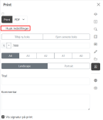
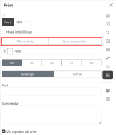
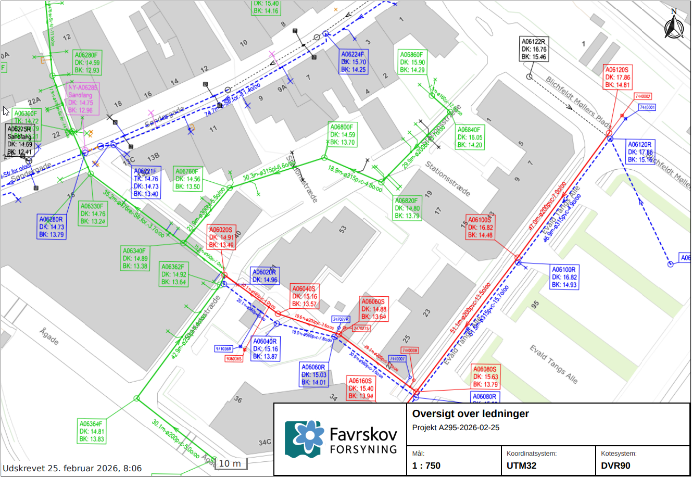
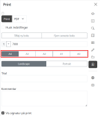
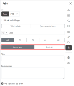
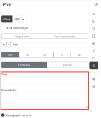
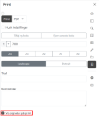

import printImg from '../resources/vidi-menu-print.gif';
import printMaalImg from '../resources/vidi-menu-print-maal.gif';
import printSkabelonerImg from '../resources/vidi-menu-print-skabeloner.gif';
import printUdskriftImg from '../resources/vidi-menu-print-udskrift.gif';

**Forfatter:** [Henrik Larsen](mailto:hbl@geopartner.dk), [Rene Giovanni](mailto:rgb@geopartner.dk)

## Hvad er print-funktionen?

Print-funktionen gør det muligt at eksportere kortet til PDF eller PNG-format. Du kan definere udskriftsområde, vælge papirstørrelse, tilføje titel og kommentar, samt inkludere signaturforklaring.

## Aktiver print-værktøjet

1. Klik på **print-ikonet** i Vidi-menuen
2. En **rød kasse** vises på kortet - dette er udskriftsområdet
3. Print-indstillinger vises i menuen

<figure class="centered-figure">
  
  <figcaption>Print-værktøjet aktiveret med rød kasse</figcaption>
</figure>

:::tip[Godt at vide]
Den røde kasse repræsenterer nøjagtigt det område, der bliver printet.
:::

## Juster udskriftsområde

Du kan tilpasse udskriftsområdet direkte på kortet:

### Flyt udskriftsområde

1. **Klik og hold** på **punktet i midten** af den røde kasse
2. **Træk** kassen til den ønskede position
3. **Slip** for at placere

### Ændre målestoksforhold

1. I print-indstillingerne angives målestoksforholdet i **1:**-feltet
2. Skriv værdien manuelt (f.eks. **10000** for **1:10000**)
3. Eller vælg et foruddefineret målestoksforhold fra dropdown-menuen
4. Når målestoksforholdet ændres, opdateres den røde kasse automatisk

<figure class="centered-figure">
  
  <figcaption>Ændring af målestoksforhold i print-indstillingerne</figcaption>
</figure>

:::note[Bemærk]
Print-størrelsen (papirstørrelsen) er konstant; når du ændrer målestoksforholdet i **1:**-feltet, ændres zoom-niveauet i den røde kasse.
:::

## Print-indstillinger

### Husk indstillinger

Du kan gemme dine print-indstillinger som standard til fremtidige print.

- ✅ **Til:** Dine valgte indstillinger gemmes og anvendes automatisk, næste gang du åbner print-værktøjet.
- ❌ **Fra:** Indstillingerne nulstilles til standard, hver gang du åbner print-værktøjet.

*Eksempel på "Husk indstillinger" aktiveret*

### Tilføj flere sider

Hvis du ønsker at udskrive flere sider, kan du tilføje flere udskriftsområder:

Klik på <MenuPath items="Tilføj ny boks" /> for at tilføje en ny udskriftskasse. Hver kasse repræsenterer en side i det endelige print.

For hver ny boks, der tilføjes, vises et sidetal i midten af boksen.

For at fjerne en udskriftsboks skal du klikke på <MenuPath items="Fjern seneste boks" />.

*Eksempel på tilføjelse af sider til print*

### Skabelon

En print-skabelon definerer layout og design af det endelige print. Det er muligt at definere hvordan følgende elementer skal vises i printet:

- **Titel og kommentar**
- **Målestoksforhold**
- **Nordpil**
- **Koordinatgitter**
- **Dato**
- med mere.

Hvis der er defineret flere print-skabeloner i konfigurationen, kan du vælge mellem dem:

<figure class="centered-figure">
  
  <figcaption>Visning af forskellige print-skabeloner</figcaption>
</figure>

*Eksempel på print skabelon*

:::note[Konfiguration]
Print-skabeloner konfigureres af systemadministratoren i Vidis kørselskonfiguration.

[Læs mere om konfiguration af print-skabeloner i GC2 →](/gc2/)
:::

### Papirstørrelse

Vælg den ønskede papirstørrelse for printet:

- **A4** (210 × 297 mm)
- **A3** (297 × 420 mm)
- **A2** (420 × 594 mm)
- **A1** (594 × 841 mm)
- **A0** (841 × 1189 mm)
- *Eller andre tilgængelige størrelser*

*Eksempel på valg af papirstørrelse*

:::note[Konfiguration af papirstørrelser]
Papirstørrelser konfigureres af systemadministratoren

[Læs mere om konfiguration af papirstørrelser i GC2 →](/gc2/)
:::

### Orientering

Vælg mellem:

- **Liggende** (landscape) - Bredden er større end højden
- **Stående** (portrait) - Højden er større end bredden

*Eksempel på valg af orientering*

### Titel og kommentar

Du kan tilføje tekst til printet:

1. **Titel** - Overskrift på printet (f.eks. "Spildevandsledninger - Område 3")
2. **Kommentar** - Yderligere beskrivelse eller noter

*Eksempel på tilføjelse af titel og kommentar*

:::note[Korthoved]
Hvis titel eller kommentar udfyldes, genereres et **korthoved** øverst på printet med denne information.
:::

### Vis signatur

Slå **signaturforklaring** til eller fra:

- ✅ **Til:** Signaturforklaring inkluderes på printet
- ❌ **Fra:** Kun kortet printes

*Eksempel på signaturforklaring slået til/fra*

:::tip[Anbefaling]
Inkluder altid signaturforklaring for at gøre printet selvforklarende.

[Læs mere om signaturforklaring →](/vidi/vidi-menuen/signaturforklaring)
:::

## Lav print

Når alle indstillinger er sat, kan du generere printet:

<figure class="centered-figure">
  
  <figcaption>Generering af print i Vidi</figcaption>
</figure>

### Print til PDF

Formatet vælges i feltet til højre for <MenuPath items="Print" />. Standard er <MenuPath items="PDF" />.

1. Kontrollér, at formatet står til <MenuPath items="PDF" />.
2. Tjek, at alle indstillinger er korrekte.
3. Klik på <MenuPath items="Print" />.
4. Vidi genererer PDF'en (kan tage nogle sekunder).

### Print til PNG

For at printe som PNG skal du først ændre formatet i feltet til højre for <MenuPath items="Print" />.

1. Klik på **dropdown-ikonet** (pil ned) i formatfeltet.
2. Vælg <MenuPath items="PNG" />.
3. Kontrollér, at formatet nu står til <MenuPath items="PNG" />.
4. Klik på <MenuPath items="Print" />.
5. PNG-billedet genereres (kan tage nogle sekunder).

:::note[Forskel på PDF og PNG]
- **PDF:** Vektorformat, skalerbar, god til print
- **PNG:** Rasterformat, fast opløsning, god til web og præsentationer
:::

## Visning og download af print

Når printet er gennemført, har du følgende muligheder:

### Åben

Klik på <MenuPath items="Åben" /> for at se printet direkte i browseren, der åbnes en ny fane.

### Download

Klik på **dropdown-ikonet** (pil ned) ved <MenuPath items="Åben" /> og vælg <MenuPath items="Download" /> i dropdown-menuen for at gemme filen på din computer.

### HTML-version

HTML-versionen er en interaktiv visning af printet i browseren. Klik på **dropdown-ikonet** (pil ned) ved <MenuPath items="Åben" /> og vælg <MenuPath items="HTML" /> i dropdown-menuen. HTML-versionen åbnes i en ny fane.

:::tip[HTML-version]
HTML-versionen kan bruges til at:
- Se en separat Vidi-visning, der følger printskabelonens layout
- Ændre kortet efter print (f.eks. ved at ændre placeringen af kortet i printet)
- For systemadministratorer: Bruge browserens udviklerværktøjer til at afprøve justeringer af printskabelonen. For at gøre ændringer permanente skal skabelonen opdateres i konfigurationen og udrulles i driftsmiljøet.

Printskabelonen kan overordnet forstås som en webside med et fast layout og styling.
:::

## Hvad inkluderes i printet?

Printet inkluderer:

- ✅ **Synlige kortlag** (de lag der er tændt)
- ✅ **Baggrundskort** (det valgte baggrundskort)
- ✅ **Tegninger** (fra tegneværktøjet)
- ✅ **Målinger** (fra måleværktøjet)
- ✅ **Signaturforklaring** (hvis aktiveret)
- ✅ **Titel og kommentar** (hvis udfyldt)
- ✅ **Målestoksforhold**
- ✅ **Nordpil** (afhænger af skabelon)
- ✅ **Dato** (afhænger af skabelon)
