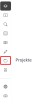

import projekterImg from '../resources/vidi-menu-projekter.gif';
import projekterNytImg from '../resources/vidi-menu-projekter-nyt.gif';
import projekterGenskabImg from '../resources/vidi-menu-projekter-genskab.gif';
import projekterOpdateretImg from '../resources/vidi-menu-projekter-opdateret.gif';
import projekterOverfoerImg from '../resources/vidi-menu-projekter-overfoer.svg';

**Forfatter:** [Henrik Larsen](mailto:hbl@geopartner.dk), [Rene Giovanni](mailto:rgb@geopartner.dk)

## Hvad er projekter?

Projektværktøjet gør det muligt at gemme og dele øjebliksbilleder af kortets tilstand. Du kan gemme aktive lag, kortudstrækning, tegninger og meget mere – og bruge projektet som en direkte genvej tilbage til, hvor du arbejdede tidligere.

*Vidi-menuen - projekter*

## Hvad gemmes i et projekt?

Når du gemmer et projekt, gemmes følgende:

- ✅ **Kortudstrækning** (zoomniveau og position)
- ✅ **Aktive lag** (hvilke lag er tændt/slukket)
- ✅ **Baggrundskort** (valgte baggrundskort)
- ✅ **Tegninger** (fra tegneværktøjet)
- ✅ **Målinger** (fra måleværktøjet)
- ✅ **Gennemsigtighedsindstillinger**
- ✅ **Filtre** på lag

## Åbn projektværktøjet

Første skridt er at åbne projektværktøjet i Vidi-menuen.

1. Klik på **projekt-ikonet** i Vidi-menuen
2. En liste med eksisterende projekter vises
3. Du kan nu gemme, indlæse eller administrere projekter

<figure class="centered-figure">
  
  <figcaption>Tilgå projekter</figcaption>
</figure>

## Gem et projekt

Når du har sat kortet op, kan du gemme opsætningen som et projekt.

### Opret nyt projekt

1. Opsæt kortet som du vil have det:
   - Tænd for relevante lag
   - Vælg baggrundskort
   - Zoom til ønsket udstrækning
   - Tegn evt. markeringer
2. Klik på **projekt-ikonet** i menuen
3. **Indtast et projekt-navn**
4. Klik på **"Gem"**-ikonet
5. Tilføj evt. et **tag** til projektet. Tags kan bruges til at filtrere projekter, hvis du har mange. Du kan også bruge filterfunktionen øverst til at søge i listen.

<figure class="centered-figure">
  
  <figcaption>Opret projekt og tilføj tag</figcaption>
</figure>

## Gemmetyper

Der er to måder at gemme projekter på:

### Lokalt gemte projekter

Projektet er kun knyttet til din browser-session.

**Fordele:**
- ✅ Hurtig adgang
- ✅ Ingen login påkrævet

**Ulemper:**
- ⚠️ Forsvinder hvis browsercachen ryddes
- ⚠️ Kun tilgængeligt i samme browser
- ⚠️ Kan ikke slettes hvis referencen mistes

### Bruger-gemte projekter

Hvis du er **logget ind** i Vidi, gemmes projektet under din brugerprofil.

**Fordele:**
- ✅ Tilgængeligt fra alle browsere
- ✅ Kan altid ændres og slettes
- ✅ Persistent lagring
- ✅ Kan deles med andre brugere

**Ulemper:**
- ⚠️ Kræver login

## Indlæs et projekt

Du kan til enhver tid genskabe en tidligere kortopsætning ved at indlæse projektet igen.

1. Åbn **projektværktøjet**
2. Find projektet i listen
3. Klik på **afspilningsikonet (Play)** ved projektet
4. Den gemte session genskabes

<figure class="centered-figure">
  
  <figcaption>Genskab projekt</figcaption>
</figure>

## Opdater et projekt

Hvis du vil gemme ændringer i et eksisterende projekt, gør du sådan:

1. **Indlæs projektet** (klik på "Play"-ikonet)
2. **Lav ændringer** (aktiver andre lag, zoom, tegn osv. ændre navn)
3. **Gem projektet igen** med samme navn
4. Projektet **opdateres** med de nye indstillinger

<figure class="centered-figure">
  
  <figcaption>Opdater projekt</figcaption>
</figure>

## Slet et projekt

Du kan slette projekter, du ikke længere har brug for.

:::caution[Vigtigt]
Når et projekt slettes, kan det **ikke** genskabes!
:::

### Slet projekt

1. Find projektet i listen
2. Klik på **skraldespandsikonet**
3. **Bekræft sletning** i dialogboksen
4. Projektet slettes permanent

:::caution[Bemærk]
Lokalt gemte projekter slettes, hvis browsercachen bliver ryddet.
:::

## Avancerede funktioner

Her finder du de funktioner, der typisk bruges til deling, publicering og overførsel af projekter.

### Overfør lokale projekter til bruger

Hvis du er logget ind, kan du overføre et lokalt gemt projekt til din brugerprofil:

1. Find det lokale projekt i listen
2. Klik på **personikonet** ved projektet
3. Klik **OK** i dialogboksen

Projektet gemmes herefter under din bruger og kan tilgås fra andre browsere.

<figure class="centered-figure">
  
  <figcaption>Overfør lokale projekter til bruger</figcaption>
</figure>

### Del link

Du kan dele et projekt direkte med kolleger eller eksterne modtagere via et projektlink.

1. Tryk på knappen <MenuPath items="Link" />
2. Projektlinket kopieres til udklipsholderen
3. **Send linket** til de ønskede modtagere
4. Modtagere kan åbne projektet (kan kræve login for adgang til lag)

:::caution[Levetid af link]

Linket virker kun, så længe projektet findes. Hvis projektet er lokalt gemt, og browsercachen ryddes, bliver både projekt og link utilgængelige.

:::

:::tip[Del projekter]
Kopier projekt-linket og send det til kolleger for at dele en specifik kortopsætning.
:::

### Token
Ved at trykke på knappen <MenuPath items="Token" /> kopieres en nøgle til udklipsholderen. Nøglen bruges til at oprette en indlejret version af Vidi, så et kort f.eks. kan vises på en hjemmeside.

[Læs mere om indlejring af Vidi →](/vidi/extensions/embed)
[Læs mere om Vidi-konfigurationer i GC2 →](/gc2/konfigurationer)

Hvis du arbejder som administrator med projekter, tokens og delte links, er det også relevant at kende [Vidi-konfigurationer i GC2 →](/gc2/konfigurationer).

### PNG

Du kan få et statisk billede (PNG) af et projekt ved at trykke på knappen **PNG** og vælge den ønskede opløsning. Derefter kopieres et link til udklipsholderen. Åbn linket i en browser for at se og downloade PNG-billedet.

