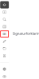
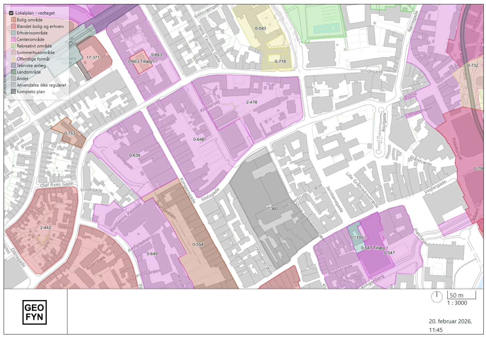

import SignaturImg from '../resources/vidi-menu-signatur.gif';

**Forfatter:** [Henrik Larsen](mailto:hbl@geopartner.dk), [Rene Giovanni](mailto:rgb@geopartner.dk)

## Hvad er signaturforklaring?

Signaturforklaringen viser symbolerne og farverne for de aktive kortlag. Den hjælper med at forstå, hvad forskellige features på kortet repræsenterer.

*Vidi-menuen - signaturforklaring*

## Vis signaturforklaring

### Åbn signaturforklaringen

1. Klik på **signaturforklaring-ikonet** i Vidi-menuen
2. Signaturforklaringen åbnes i menuen
3. Kun **aktive lag** vises i signaturforklaringen

<figure class="centered-figure">
  
  <figcaption>Signaturforklaringen</figcaption>
</figure>

## Vis signaturforklaring på kortet

Du kan vise signaturforklaringen direkte på kortvinduet i stedet for i menuen.

1. Åbn signaturforklaringen i menuen
2. Klik på <MenuPath items="Vis signaturen ovenpå kortet" />
3. Signaturforklaringen flyttes til **nederst til højre** på kortet

:::tip[Nyttigt]
Vis signaturforklaring på kortet, når du:
- Skal præsentere kortet for andre
- Laver screenshots
- Printer kortet
- Vil have mere plads i menuen
:::

:::caution[Vigtigt]
Når du deaktiverer et lag i signaturforklaringen, slukkes både signaturen OG laget på kortet.
:::

### Automatisk opdatering

Signaturforklaringen opdateres automatisk når du:
- **Tænder** eller **slukker** for lag
- **Ændrer lagets styling** (i GC2)
- **Skifter til et projekt** med andre aktive lag

## Signaturforklaring i print

Når du printer kortet, kan du vælge om signaturforklaringen skal inkluderes:

1. Gå til **Print-funktionen**
2. Sæt flueben i afkrydsningsfeltet ved <MenuPath items="Vis signatur på print" />
3. Signaturforklaringen inkluderes i PDF'en

*Signaturforklaring på print*

[Læs mere om print-funktionen →](/vidi/vidi-menuen/print)

## Konfiguration af signaturer

Hvordan signaturer ser ud, konfigureres i GC2:

- **Symboler** (punkter, linjer, polygoner)
- **Farver** og **tykkelser**
- **Mønstre** og **skravering**
- **Beskrivende tekst** for hver symboltype
- **Gruppering** af symboler

:::note[GC2-konfiguration]
[Læs mere om klasser, symboler og labels i GC2 →](/gc2/skemaindstillinger/kort/klasser-symboler-og-labels)
:::
