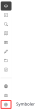

import symbolerfotoImg from '../resources/vidi-menu-symboler.gif';
import symbolerPlacerImg from '../resources/vidi-menu-symboler-placer.gif';
import symbolerSkaleringImg from '../resources/vidi-menu-symboler-skalering.gif';
import symbolerRotationImg from '../resources/vidi-menu-symboler-rotation.gif';
import symbolerLaasImg from '../resources/vidi-menu-symboler-laas.gif';
import symbolerAutoScaleImg from '../resources/vidi-menu-symboler-auto-scale.gif';
import symbolerKopierImg from '../resources/vidi-menu-symboler-kopier.gif';
import symbolerSletImg from '../resources/vidi-menu-symboler-slet.gif';

**Forfatter:** [Henrik Larsen](mailto:hbl@geopartner.dk)

## Hvad er symbol-udvidelsen?

Symbol-udvidelsen gør det muligt at placere SVG-symboler på kortet. Du kan skalere, rotere og låse symboler, samt gruppere dem i kategorier.

:::note[Extension påkrævet]
Symbol-udvidelsen er en extension der ikke er aktiveret som standard. Kontakt din administrator, hvis du har brug for denne funktion. [Læs mere om symbol-udvidelsen →](/vidi/extensions/symboler)
:::

*Vidi-menuen - symboler*

## Åben symbol-funktionen

1. Klik på **symbol-ikonet** i Vidi-menuen
2. En liste med tilgængelige symboler vises
3. Du kan nu placere symboler på kortet

<figure class="centered-figure">
  
  <figcaption>Symboler i Vidi-menuen</figcaption>
</figure>

## Tilgængelige symboler

Hvilke symboler der er tilgængelige, afhænger af konfigurationen. Typiske kategorier:

- **Trafikskilte** - Vej- og trafikmarkeringer
- **Miljø** - Affaldsstativer, genbrugsstationer
- **Forsyning** - El-master, vandforsyning, spildevand
- **Planlægning** - Planlagte installationer, fremtidig udvikling
- **Brugerdefinerede** - Organisationsspecifikke symboler

:::note[Konfiguration]
Symboler og kategorier konfigureres i Vidi's kørselskonfiguration. Kontakt din administrator for at få tilføjet eller ændret symboler.
:::

## Anvendelse af symboler

Når symbolet er placeret på kortet, vil symbolet have nogle ikonerne som kan anvendes til roterer, skalere, kopiere og slette symboler. Symbolerne vil altid blive vist for de enkelte symboler, medmindre de er låst. Når symboler er låst, vil ikonerne forsvinde og symbolerne kan ikke redigeres eller flyttes ved et uheld.

### Placering af symboler

1. **Vælg et symbol** fra oversigten
2. **Træk og slip** symbolet ind på kortet.
3. Symbolet placeres på positionen

<figure class="centered-figure">
  
  <figcaption>Placering af symboler</figcaption>
</figure>

### Flyt symboler

Hvis symboler ikke er låst:

1. **Klik og hold** på symbolet
2. **Træk** til ny position
3. **Slip** for at placere

### Skalering af symboler

Du kan ændre størrelsen på symboler:

1. **Vælg symbol** før placering
2. **Juster skalering** ved at trykke hive i skalering-ikonet.

<figure class="centered-figure">
  
  <figcaption>Skalering af symboler</figcaption>
</figure>

### Rotation af symboler

Du kan rotere symboler:

1. **Vælg symbol** før placering
2. **Indtast rotation** i grader (0-360°)
3. **Placer symbol** med den valgte rotation

<figure class="centered-figure">
  
  <figcaption>Rotation af symboler</figcaption>
</figure>

### Kopiér symboler

1. **Vælg symbol** ved at klikke på det
2. **Klik "Kopiere symbol"** for at kopiere
3. **Kopi placeres ovenpå originalen**
4. **Træk kopien** til ønsket position

<figure class="centered-figure">
  
  <figcaption>Kopiér symboler</figcaption>
</figure>

### Slet symboler

Du kan slette individuelle symboler eller alle symboler:

1. **Klik på symbol** for at vælge
2. **Klik på skraldespand-ikonet** for at slette det valgte symbol

<figure class="centered-figure">
  
  <figcaption>Slet symboler</figcaption>
</figure>

:::tip[Slet alle symboler]
For at slette alle symboler trykkes der på **Ryd kortet** i Værktøjslinjen. Når kortet ryddes sletter det alle symboler, tegninger og andre elementer. [Læs mere om ryd kortet →](/vidi/vaerktojslinjen/kortadministration#ryd-kortet)
:::

## Avancerede funktioner

### Lås symboler (Lock)

Når symboler er låst, kan de ikke flyttes eller redigeres ved et uheld:

1. Placer symboler som ønsket
2. Klik på **"Lås symboler"**
3. Symboler kan ikke længere flyttes
4. Klik på **"Lås op"** for at redigere igen

<figure class="centered-figure">
  
  <figcaption>Lås symboler</figcaption>
</figure>

:::tip[Professionel tip]
Lås symboler når du skal præsentere kortet, så de ikke flyttes ved uheld.
:::

### Auto skalering (Auto scale)

Auto skalering gør at symbolerne bevarer samme visuelle størrelse uanset zoom-niveau:

1. Aktivér **"Auto scale"**
2. Symboler skaleres automatisk med zoom
3. Deaktivér for at symboler har fast størrelse på kortet

<figure class="centered-figure">
  
  <figcaption>Auto scale af symboler</figcaption>
</figure>

**Anvendelse:**
- **Auto scale TIL:** Symbol skal være synligt ved alle zoom-niveauer
- **Auto scale FRA:** Symbol repræsenterer faktisk størrelse på terræn

## Tips og tricks

### Konsistent skalering

- Brug samme skalering for samme type symbol
- Større symboler for vigtige punkter
- Mindre symboler for sekundære punkter

### Effektiv placering

1. Zoom til korrekt niveau først
2. Vælg symbol og indstillinger
3. Placer alle symboler af samme type
4. Skift til næste symboltype
5. Gentag

### Kombiner med tegneværktøj

1. Tegn område med tegneværktøj
2. Placer symboler inden for området
3. Kombiner til komplet visualisering

[Læs mere om tegneværktøjet →](/vidi/vidi-menuen/tegnevaerktoj)

### Gem i projekt

Symboler forsvinder ved genindlæsning, medmindre du gemmer dem:

1. Placer alle symboler
2. Gem som projekt
3. Symboler genindlæses med projektet

[Læs mere om projekter →](/vidi/vidi-menuen/projekter)
